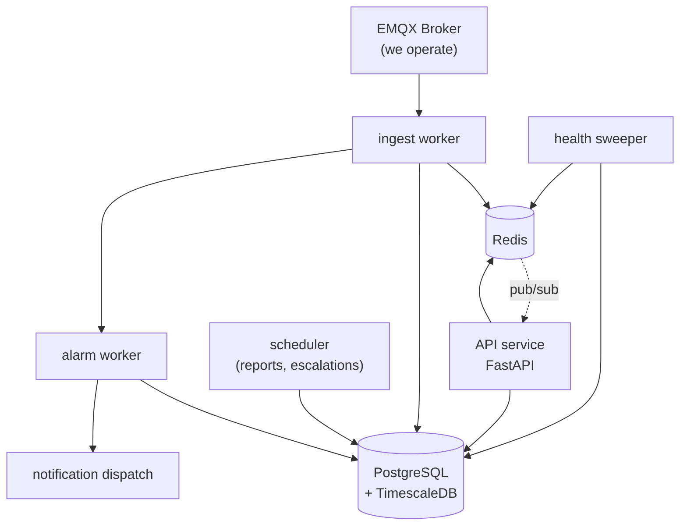

# SolarCMS Backend — Build Specification

**Version:** 1.9 · **Date:** 19 September 2026
**Audience:** an engineering agent implementing the backend from scratch.

---

## 0. Read This First

### 0.1 Authority

This document tells you **how to build**. [`MASTER_SPECIFICATION.md`](MASTER_SPECIFICATION.md) tells you **what is true**. Where they conflict, MASTER_SPECIFICATION wins on facts (vocabulary, confirmed decisions, scope) and this document wins on implementation (structure, libraries, signatures).

### 0.2 Do not touch the existing prototype

`backend/` and `frontend/` in this repository contain a throwaway prototype. **Do not modify, extend, refactor, or import from them.** Build in a new directory. The prototype's only value is as a reference for the field payload shape (`VOLTAGE_RY`, `TOTAL_ACTIVE_POWER`).

### 0.3 Assumed values — the most important rule in this document

Several inputs are **not yet known**: units per Tag, the client's PR/CUF/Availability formulas, alarm thresholds, and polling intervals. This specification supplies **placeholder values so that work can proceed**.

Every one of them is wrong until the client confirms it.

**Therefore: every assumed value lives in exactly one module — `src/solarcms/domain/assumptions.py`.** No assumed constant, threshold, unit, or formula coefficient may appear anywhere else in the codebase. Replacing an assumption must be a single-file edit, never a search across the project.

Assumed items are listed in §12 and marked **`⚠ ASSUMED`** throughout.

### 0.4 Vocabulary is enforced

Use the canonical terms from MASTER §1 in every identifier — table names, columns, classes, variables, API fields, log messages. This specification adopts two renames MASTER_SPECIFICATION lists as PROPOSED:

| Use this | Not this |
|---|---|
| `clients` | `tenants` |
| `tags`, `tag_id` | `parameters`, `tag_definitions` |
| `alarms` | `alarm_events` |
| `device_tag_bindings` | `device_parameter_bindings` |

**`⚠ ASSUMED`** — the choice of "Tag" over "Parameter" resolves OPEN-1 in the direction the evidence favours. If the client chooses "Parameter", it is one rename migration.

---

## 1. System Shape

Five independent processes. They share a database and a Redis instance and nothing else.



| Process | Entry point | Why separate |
|---|---|---|
| **API** | `uvicorn solarcms.api.main:app` | Serves REST + WebSocket. Restarts on every deploy. |
| **Ingest** | `python -m solarcms.workers.ingest` | Must survive API deploys (SSOT I-7). Holds the MQTT session. |
| **Alarm** | `python -m solarcms.workers.alarm` | Reads the stream, not the database, so Alarm latency is independent of write batching. |
| **Health sweeper** | `python -m solarcms.workers.health_sweeper` | Periodic. Detects Devices that have gone *silent* — the absence of data triggers nothing on its own. |
| **Scheduler** | `python -m solarcms.workers.scheduler` | Cron-like: scheduled Reports, Alarm Escalation timers, rollup verification. |

**Never** put ingestion inside the API process, even temporarily. It is the one architectural rule that is expensive to undo.

---

## 2. Stack

```toml
# pyproject.toml — pin exact versions
[project]
requires-python = ">=3.12"
dependencies = [
    "fastapi==0.115.0",
    "uvicorn[standard]==0.30.6",
    "pydantic==2.9.2",
    "pydantic-settings==2.5.2",
    "sqlalchemy==2.0.35",
    "alembic==1.13.3",
    "asyncpg==0.29.0",
    "aiomqtt==2.3.0",
    "redis==5.0.8",
    "pyjwt==2.9.0",
    "argon2-cffi==23.1.0",
    "openpyxl==3.1.5",
    "weasyprint==62.3",
    "httpx==0.27.2",
    "structlog==24.4.0",
]
[project.optional-dependencies]
dev = ["pytest==8.3.3", "pytest-asyncio==0.24.0", "testcontainers==4.8.1", "ruff==0.6.8", "mypy==1.11.2"]
```

**Rationale for the non-obvious choices:**

- **`aiomqtt`, not `paho-mqtt`.** The prototype used the synchronous paho client and had to marshal every callback onto the event loop with `run_coroutine_threadsafe`. That pattern is a source of subtle deadlocks. `aiomqtt` is natively async.
- **`asyncpg` directly for the ingest hot path.** Use SQLAlchemy Core/ORM for CRUD, but write Readings with `asyncpg`'s `copy_records_to_table`. Batched `COPY` is roughly two orders of magnitude faster than per-row `INSERT`.
- **`argon2`, not bcrypt.** No 72-byte password truncation.

---

## 3. Directory Structure

```
solarcms-backend/
├── pyproject.toml
├── alembic.ini
├── .env.example
├── docker-compose.yml            # Postgres+Timescale, Redis, EMQX for local dev
├── alembic/
│   └── versions/                 # numbered migrations, never edited after merge
├── src/solarcms/
│   ├── config.py                 # pydantic-settings; all env vars, no os.getenv elsewhere
│   ├── logging.py                # structlog setup; JSON in prod
│   │
│   ├── db/
│   │   ├── session.py            # async engine, session factory, RLS context manager
│   │   ├── rls.py                # SET LOCAL app.* helpers
│   │   └── models/               # SQLAlchemy declarative models, one file per domain
│   │       ├── identity.py       # clients, users, roles, permissions, memberships,
│   │       │                     #   user_plant_access, user_dashboard_access, dashboards
│   │       ├── catalog.py        # device_types, device_models, tags
│   │       ├── assets.py         # regions, blocks, plants, devices, device_tag_bindings
│   │       ├── telemetry.py      # readings, mqtt_raw (hypertables)
│   │       ├── health.py         # device_health, device_health_events
│   │       ├── alarming.py       # alarm_rules, alarms, escalation_*, notification_*
│   │       ├── reporting.py      # report_definitions, report_schedules, report_runs
│   │       └── audit.py          # audit_log
│   │
│   ├── domain/                   # PURE LOGIC. No DB, no network, no I/O. Fully unit-tested.
│   │   ├── assumptions.py        # ⚠ EVERY assumed value in the system. Nothing else.
│   │   ├── decoding.py           # topic parsing, scaling, quality classification
│   │   ├── formulas.py           # PR, CUF, specific yield, availability, CO2
│   │   ├── alarm_logic.py        # threshold/debounce/hysteresis evaluation
│   │   ├── health_logic.py       # staleness, frozen-value, completeness
│   │   ├── tiering.py            # which aggregate tier serves a given time range
│   │   ├── sld.py                # builds the Single Line Diagram tree from a Device list
│   │   ├── sld_stages.py         # folds that tree into the fixed four: PV → INV → TX → Grid
│   │   ├── slots.py              # resolves a dashboard position against a Plant's own Devices
│   │   └── dashboard_spec.py     # the default slot catalogue, seeded to `dashboard_slots`
│   │
│   ├── cache/
│   │   ├── keys.py               # every Redis key pattern, centralised
│   │   └── live.py               # read/write current values, plant rollups, pub/sub
│   │
│   ├── schemas/                  # Pydantic request/response models, one file per router
│   │
│   ├── services/                 # orchestration: domain + db + cache
│   │   ├── onboarding.py         # client → plant → device → binding → commissioning → active
│   │   ├── analytics.py          # KPI computation, tier-routed history queries
│   │   ├── dashboard.py          # loads the slot catalogue, gathers facts, resolves a Plant
│   │   ├── alarming.py
│   │   ├── reporting.py
│   │   └── notifications.py
│   │
│   ├── api/
│   │   ├── main.py               # app factory, middleware, exception handlers
│   │   ├── deps.py               # auth dependency, RLS session dependency, permission guards
│   │   ├── auth.py               # JWT issue/verify, password hashing
│   │   ├── ws.py                 # WebSocket endpoint + room management
│   │   └── routers/
│   │       ├── auth.py       clients.py     plants.py      devices.py
│   │       ├── catalog.py    readings.py    alarms.py      reports.py
│   │       ├── users.py      health.py      audit.py
│   │
│   └── workers/
│       ├── ingest.py             # MQTT → decode → Redis + COPY batch
│       ├── alarm.py              # stream consumer → rule evaluation
│       ├── health_sweeper.py     # periodic staleness detection
│       └── scheduler.py          # report schedules, escalation timers
└── tests/
    ├── unit/                     # domain/ only. No fixtures beyond plain data.
    ├── integration/              # testcontainers: real Postgres+Timescale, real Redis
    └── conftest.py
```

**The `domain/` boundary is the design.** Anything in `domain/` must be callable with plain Python values and return plain Python values. That is what makes the formulas — the part most likely to be wrong and most likely to change — testable and replaceable without touching infrastructure.

---

## 4. Configuration

All environment variables, declared once in `config.py`. No `os.getenv` anywhere else.

```python
class Settings(BaseSettings):
    # Database
    database_url: PostgresDsn                    # postgresql+asyncpg://...
    db_pool_size: int = 10

    # Redis
    redis_url: RedisDsn

    # MQTT — we operate the broker (SSOT F-17)
    mqtt_host: str
    mqtt_port: int = 8883
    mqtt_tls: bool = True
    mqtt_username: str                           # the ingest worker's own subscriber credential
    mqtt_password: SecretStr
    mqtt_topic_root: str = "scms/v1"

    # Auth
    jwt_secret: SecretStr
    jwt_access_ttl_seconds: int = 900            # 15 min
    jwt_refresh_ttl_seconds: int = 604800        # 7 days

    # Ingestion tuning
    ingest_batch_max_rows: int = 5000
    ingest_batch_max_seconds: float = 2.0

    # Storage
    s3_bucket: str
    s3_region: str = "ap-south-1"

    # Notifications
    smtp_url: str | None = None
    whatsapp_api_url: str | None = None          # ⚠ provider unconfirmed
    whatsapp_api_token: SecretStr | None = None
```

---

## 5. Database

### 5.1 Migrations

Alembic only. `backend/schema/001_core_schema.sql` in this repo is a **reference sketch, not a migration** — read it for intent, then author proper Alembic revisions with the renames from §0.4 applied.

Migration order:

| Revision | Contents |
|---|---|
| `0001` | Extensions (`timescaledb`, `pgcrypto`, `citext`), identity + RBAC tables |
| `0002` | Catalog: `device_types`, `device_models`, `tags` |
| `0003` | Assets: `regions`, `blocks`, `plants`, `devices`, `device_tag_bindings`. **No `locations` table — retired.** |
| `0004` | Telemetry: `readings`, `mqtt_raw` as hypertables; compression; retention |
| `0005` | Continuous aggregates `agg_1m` → `agg_15m` → `agg_1h` → `agg_1d` + policies |
| `0006` | Health, alarms, escalation, notifications |
| `0007` | Reporting, audit |
| `0008` | RLS policies and helper functions (last — needs all tables present) |
| `0021` | `dashboard_slots` + `dashboard_slot_candidates` (platform catalogue), `plant_dashboard_slot_overrides` (Client-owned, RLS), `device_table_columns`, and `device_types.sld_stage` |
| `0024` | `plant_collectors` — the one outward edge an enclosure owns (plant, code, `parent_device_id`, note). NOT a Device: no Model, no Tags, no topic. Membership stays `devices.collector_code`; a Collector needs no row here to exist, so the table is sparse and joins are LEFT |
| `0023` | Real-time aggregation on all four tiers (`materialized_only = false`). ⚠ Behaviour, not shape: the helper's `real_time=True` had been silently ineffective since TimescaleDB 2.13 flipped the default, leaving `agg_1h` ~2.5 h stale through the hierarchical cascade |
| `0022` | `devices.collector_code` — the Collector as a *name* on the Device, because it is an enclosure and not a Device (MASTER §3.4). Partial index on `(plant_id, collector_code)`; a CHECK forbidding a blank name |

**`regions` and `blocks` are fully in scope.** The hierarchy is confirmed (MASTER §2.1) and Block semantics are defined (MASTER §2.1.1). Build them with working business logic.

**A Block is a Client-defined subdivision of a Plant** — "North Zone", "South Block". Implement it as:

| Rule | Implementation |
|---|---|
| Optional | `devices.block_id` is nullable. A Device with `block_id IS NULL` belongs directly to the Plant |
| Flat | **No `parent_block_id`.** One level only |
| Geographic, not electrical | Blocks never appear in the Single Line Diagram. `/plants/{id}/sld` walks `parent_device_id`, ignoring `block_id` entirely |
| Carries capacity | `blocks.capacity_kwp NOT NULL` — required so PR, CUF and specific yield are computable per Block |
| Not an access boundary | Plant Assignment stays Plant-level. Do **not** add Block-level visibility scoping |

### 5.2 Schema deltas from the reference sketch

Apply all of these; each is recorded in MASTER_SPECIFICATION:

```sql
-- Device Type catalogue (MASTER §2.2)
ALTER TABLE device_types  ADD COLUMN in_power_path BOOLEAN NOT NULL DEFAULT false;
ALTER TABLE device_types  ADD COLUMN variant_set   TEXT[];
ALTER TABLE device_models ADD COLUMN variant       TEXT;

-- The three groupings of a Device (MASTER §3.4, I-10). All three are independent.
--   block_id              → where it is        (geographic)
--   parent_device_id      → what it feeds into (electrical)  — already present
--   reports_via_device_id → what transmits it  (communication)
ALTER TABLE devices ADD COLUMN block_id              BIGINT REFERENCES blocks(id);
ALTER TABLE devices ADD COLUMN reports_via_device_id BIGINT REFERENCES devices(id);
-- No devices.location_id — the Location level is retired.

-- Parent must share the Plant (SSOT I-3)
ALTER TABLE devices ADD CONSTRAINT uq_device_plant UNIQUE (id, plant_id);
ALTER TABLE devices ADD CONSTRAINT fk_parent_same_plant
    FOREIGN KEY (parent_device_id, plant_id) REFERENCES devices (id, plant_id);

-- Tag classification and write throttling
ALTER TABLE tags ADD COLUMN category TEXT NOT NULL DEFAULT 'performance'
    CHECK (category IN ('performance','electrical','diagnostic','environmental','status'));
ALTER TABLE tags ADD COLUMN min_interval_s INT NOT NULL DEFAULT 60;

-- Source vs receipt time (tender §28)
ALTER TABLE readings ADD COLUMN source_time TIMESTAMPTZ;   -- device clock, nullable
-- readings.time remains the authoritative index column = receipt time

-- Hot small table, updated every cycle
ALTER TABLE device_health SET (
    autovacuum_vacuum_scale_factor = 0.0,
    autovacuum_vacuum_threshold = 50
);
```

### 5.3 Retention

| Tier | Resolution | Retention |
|---|---|---|
| `readings` | native | 30 days |
| `agg_1m` | 1 minute | 1 year |
| `agg_15m` | 15 minutes | 3 years |
| `agg_1h` | 1 hour | **10 years** |
| `agg_1d` | 1 day | **10 years** |
| `mqtt_raw` | native | 90 days |

Each continuous aggregate stores `avg_value`, `min_value`, `max_value`, `last_value`, `sample_count`. A continuous aggregate cannot branch on `tags.rollup_method`, so store all four and let the read path choose.

### 5.4 Row-Level Security

Four session variables, set from verified JWT claims at the start of every request:

```sql
SET LOCAL app.user_id           = '42';
SET LOCAL app.client_id         = '7';
SET LOCAL app.role_code         = 'employee';
SET LOCAL app.is_platform_admin = 'false';
```

Two-tier enforcement:

- **Client isolation** — on every Client-owned table, including `readings`.
- **Plant visibility** — on `plants`, `devices`, `alarms`, `device_health` (tables carrying `plant_id`). `readings` inherits it, because the caller reaches Readings only through an already-filtered Device list.

```sql
CREATE POLICY plant_visibility ON plants
USING (
    client_id = app_client_id() AND (
        app_is_platform_admin()
        OR app_role_code() = 'admin'
        OR id IN (SELECT upa.plant_id FROM user_plant_access upa
                  JOIN memberships m ON m.id = upa.membership_id
                  WHERE m.user_id = app_user_id() AND m.client_id = app_client_id())
    )
);
```

**Employee with zero assignments sees zero Plants** (SSOT I-5). Absence of assignment is never full access.

⚠ **PgBouncer must run in transaction mode.** Statement mode leaks these session variables between Clients and defeats the entire isolation model. If you add a pooler, verify this.

---

## 6. Ingestion

### 6.1 Topic contract

```
scms/v1/{client_code}/{plant_code}/{collector_code}/{device_code}
scms/v1/{client_code}/{plant_code}/{device_code}
```

Both shapes are registered rows in `topic_patterns`, matched by segment count. **The Collector is optional** (CONFIRMED, 19 Sep 2026): it names the enclosure a set of Devices sits in — an MCR, an ICR, a panel — and plenty of equipment sits in none. A Device matched on the five-segment shape is recorded with `collector_code` NULL, which is a real answer and not a gap.

A Collector is **never a Device**. It publishes nothing, so it has no topic of its own; it carries no current, so it has no place in the electrical tree. `devices.collector_code` holds the segment as a name, and the diagram draws it as an outline around the Devices that share it. Registering it as a Device — which commissioning did until migration 0022 — puts a room in the Single Line Diagram between the Inverters and the meter.

The ingest worker subscribes to `scms/v1/#` with QoS 1 and a persistent session (`clean_session=false`, fixed `client_id`) so a restart replays anything missed.

The topic is the **sole** source of origin. Never inspect the payload to determine Client, Plant, or Device.

### 6.2 Payload

**`⚠ ASSUMED` shape** — modelled on the client's existing REST body (MASTER §9):

```json
{
  "device": "INV-01",
  "timestamp": "2026-09-10T13:40:46+05:30",
  "readings": [
    {"tag": "AC_ACTIVE_POWER", "value": "1985"},
    {"tag": "AC_VOLTAGE_RY",   "value": "4152"}
  ]
}
```

Accept string-typed values — the client's existing system sends `"336"`, not `336`. Coerce, and mark unparseable values bad-quality rather than dropping the message.

### 6.3 Pipeline

```
receive → parse topic → resolve device (cached) → for each reading:
    look up binding → apply scale/offset → classify quality → throttle by min_interval_s
  → write Redis current value
  → append to COPY buffer
  → publish to alarm stream
flush buffer on 5000 rows or 2.0 s, whichever first → COPY into readings + mqtt_raw
```

Core signature, in `domain/decoding.py`, pure:

```python
def decode(
    topic: str,
    payload: dict,
    resolver: DeviceResolution,      # device_id, client_id, plant_id, bindings, tag specs
    now: datetime,
) -> DecodeResult:
    """Returns rows to write, quality flags, and any rejection reason.
    No I/O. Fully unit-testable."""
```

**Rules that matter:**

1. **Unknown topic → quarantine, never infer.** Write to `mqtt_raw`, raise an Alarm, do not attach to a Client. A wrong inference silently merges one Client's data into another's history.
2. **Acknowledge only after commit.** With QoS 1, a crash then means redelivery rather than loss. This is why the batch window is 2 seconds, not 2 minutes.
3. **Cache the Device resolution in Redis** keyed by topic, TTL 300 s, invalidated on Device or binding change. Do not hit Postgres per message.
4. **Both timestamps.** `source_time` = payload timestamp (may be a drifted device clock). `time` = receipt. Index and query on `time`; retain `source_time` per tender §28.
5. **Negative energy deltas are suspect, not data.** A counter that decreases is either a rollover or a meter replacement, and those are indistinguishable in the stream (MASTER §5.4, OPEN-14). Flag it, alarm it, do not silently accept it.

### 6.4 Quality classification

```python
QUALITY_GOOD = 0
QUALITY_OUT_OF_RANGE = 1   # outside tags.valid_min/valid_max
QUALITY_STALE = 2          # source_time older than expected_interval_s × 2
QUALITY_UNPARSEABLE = 3
```

Out-of-range values are **stored and flagged**, never discarded. `3.29151E-41` appearing in a reactive-power Tag is diagnostic information.

---

## 7. Redis

Every key pattern lives in `cache/keys.py`. Nothing durable is stored here — a full flush must cost at most one heartbeat cycle.

| Key | Type | Contents | TTL |
|---|---|---|---|
| `live:device:{device_id}` | hash | `tag_id → value`, plus `_ts` | 900 s |
| `live:plant:{plant_id}` | hash | Plant rollups: active power, PR, availability | 30 s |
| `live:portfolio:{client_id}` | hash | Portfolio KPI tiles | 30 s |
| `resolve:topic:{topic}` | string | JSON Device resolution | 300 s |
| `cache:analytics:{sha256}` | string | Memoised range-query response | 60 s |
| `alarm:state:{rule_id}:{device_id}` | hash | Debounce counter, first-breach time | 3600 s |
| `ws:fanout` | pub/sub | Live Reading fan-out across API replicas | — |
| `stream:readings` | stream | Alarm worker's input | maxlen 100k |

**`ws:fanout` is not optional.** With more than one API process, a WebSocket held by process A never sees a Reading received by the ingest worker without it.

---

## 8. API

### 8.1 Auth

JWT access token (15 min) + refresh token (7 days). Claims:

```json
{"sub": 42, "client_id": 7, "role": "employee", "platform_admin": false, "exp": 0}
```

A User may belong to several Clients (MASTER §3.2 `memberships`). The token carries **one active** `client_id`; `POST /auth/switch-client` reissues against another membership.

Every request: `deps.py` verifies the token, opens a session, sets the four RLS variables, yields.

Guards compose:

```python
@router.post("/alarms/{alarm_id}/acknowledge")
async def acknowledge(
    alarm_id: int,
    user: User = Depends(require_permission("alarm.acknowledge")),
    db: AsyncSession = Depends(get_rls_session),
): ...
```

**Permission checks belong in the API and database layers.** Hiding a menu item is not access control (tender §30).

### 8.2 Endpoints

| Method | Path | Permission | Notes |
|---|---|---|---|
| POST | `/auth/login` | — | Audit success **and** failure (tender §33) |
| POST | `/auth/refresh` `/auth/logout` `/auth/switch-client` | — | |
| GET | `/auth/me` | — | User, role, accessible Plants, accessible dashboards |
| GET/POST/PATCH | `/clients` `/clients/{id}` | `system.admin` | Super Admin only. `POST` takes a **JSON body**, not query parameters (a GSTIN or contact email in a query string lands in every access log and proxy cache). Body carries the ⚠ PROPOSED commercial fields — `client_number`, `gst_number`, `contact_email`, `contract_start_date`, `contract_valid_days` — all optional (migration 0019, MASTER OPEN-20). The route resolves `contract_valid_days` to a stored `contract_valid_till` **date**; `PATCH` takes that date directly, since renewal is "it now runs to this date". A re-used `client_number` is a 409, not a 500. BUILT |
| GET | `/regions` | any authenticated | Catalogue — every Client reads it. BUILT |
| POST/PATCH | `/regions` `/regions/{id}` | `system.admin` | Codes ISO 3166-2 (`IN-UP`). Migration 0018 grants the API INSERT/UPDATE; 0008 gave SELECT only, so no Region could be created through the API. BUILT |
| GET | `/plants` | `dashboard.view` | RLS-filtered. Paginated, sortable, filterable. Each row carries `client_id`/`client_code`/`client_name`, and an optional `?client_id=` narrows the list. ⚠ A filter, never a grant: it ANDs with the policy, so a Client Admin passing another Client's id gets an empty page. `client_code`/`client_name` may be null where the Client row itself is unreadable (a Guest on a non-demonstration Client), which is why the join is LEFT — an inner join would turn a label into an access control. BUILT |
| POST/PATCH | `/plants` `/plants/{id}` | `plant.manage` | **A Plant is filed under a Client before it exists.** For a Client Admin, `client_id` comes from the token and any value in the body is *ignored* — not validated, ignored — so they cannot file a Plant under another Client (I-9). A Super Admin belongs to no Client, so `client_id` in the body is **required** and checked to exist; without it the request is a 422 naming what is missing. (It used to be omitted entirely, which meant a Super Admin had to switch the session into a Client first and the Plant landed under whichever Client that happened to be.) Both accept `device_counts` as a **map of Device Type code → planned count**, validated against the seeded `device_types` (an unknown code is a 422), never a field per Type. On `PATCH` the map **replaces** the set: `{}` clears it, omitting the key leaves it alone. BUILT |
| GET | `/plants/{id}` | `dashboard.view` | Detail + current KPIs. Also returns `device_counts`: per Device Type, the ⚠ PROPOSED `planned_count` beside the live `registered_count`, so commissioning progress is the gap between them (migration 0019, MASTER OPEN-21). BUILT |
| GET | `/plants/{id}/kpis` | `dashboard.view` | `?period=today\|month\|year\|lifetime`. The aggregate tier is chosen by `domain/tiering.select_tier`, never hardcoded — a day range resolves to `agg_1m`, so the figure an operator watches is served from one bucket above raw rather than from the slowest tier in the cascade. Returned as `source_tier` for provenance. BUILT |
| GET | `/plants/{id}/sld` | `dashboard.view` | Power-path tree only (`in_power_path = true`). Each node carries `collector_code`; `collectors` rolls the Plant's enclosures up with their members, power-path and not, so the caller can label the outlines without walking the tree. A Collector is never a node. BUILT |
| GET | `/plants/{id}/dashboard` | `dashboard.view` | The fixed dashboard, resolved. Same panels and positions on every Plant; only the Device that answered each slot differs, and that provenance travels with the value. `undefined_reason` distinguishes `no_source` (a commissioning gap) from `no_value` (an instrument gone quiet) — never 0.0 for either. BUILT |
| GET | `/plants/{id}/sld-stages` | `dashboard.view` | The four-stage schematic: **PV Array → Inverters → Transformer → Grid**, always those four in that order. A stage with no Devices renders `instrumented: false`. `unstaged` lists power-path Devices whose Type has no `sld_stage` — a catalogue gap, reported rather than silently dropped. BUILT |
| GET | `/catalog/device-table-columns` | `dashboard.view` | The curated columns of a per-Device summary table, by Device Type — not everything a Device publishes. BUILT |
| POST/PATCH | `/plants` `/plants/{id}` | `plant.manage` | Client Admin permitted (SSOT F-15) |
| GET | `/plants/{id}/blocks` | `dashboard.view` | Blocks with their own KPIs. Empty array when the Plant has none |
| POST/PATCH/DELETE | `/plants/{id}/blocks` `/blocks/{id}` | `plant.manage` | Client Admin permitted |
| GET | `/blocks/{id}/kpis` | `dashboard.view` | Same periods as Plant KPIs, scaled to `blocks.capacity_kwp` |
| GET | `/discovery/clients` | `system.admin` | Client codes seen on the broker, with plant codes and whether each is registered. Reads `mqtt_raw_v`, never MQTT — Guardrail 3. BUILT |
| GET | `/discovery/plants` | `system.admin` | `?client_code=` — Plants under that code with their Collectors, Devices and registration state. BUILT |
| GET | `/discovery/topic` | `system.admin` | `?topic=&device_type_code=` — the latest payload, the flat form ingest would decode, the observed keys with suggested Tags, the **measured** publish interval, and whether a Device is registered for it now. BUILT |
| DELETE | `/devices/{id}` | `plant.manage` | Refuses a Device with stored Readings unless `?force=true`, because `readings` has no foreign key and deleting would strand them under an unresolvable id. Decommissioning is the alternative that keeps history. BUILT |
| GET | `/plants/{id}/devices` | `dashboard.view` | `?block_id=` filters to one Block. Returns enough per row to answer “what is this thing” without a second request — the three groupings plus `collector_code`, the Model, the serial, the capacity, the string count, the health figures and the binding count — because the diagram opens a Device's full record on click and a round trip per click makes it feel broken. BUILT |
| GET | `/devices/{id}` | `dashboard.view` | Includes Device Health |
| POST | `/devices` `/devices/bulk-import` | `plant.manage` | CSV import |
| GET/PUT | `/devices/{id}/bindings` | `config.modify` | |
| POST | `/devices/{id}/credential` | `plant.manage` | Mints broker credential. **Scoped to own Client only** (SSOT I-9). Returned once |
| GET | `/catalog/device-types` `/device-models` `/tags` | `dashboard.view` | |
| GET | `/catalog/device-models/{id}/tags` | `dashboard.view` | The Model's signal schedule (`device_model_tags`) with `default_source_key` — seeds a Device's bindings, never authoritative over them. BUILT |
| POST/PATCH | same | `system.admin` | Catalog is global, platform-owned |
| GET | `/readings` | `dashboard.view` | `device_ids`, `tag_ids`, `from`, `to`, `resolution=auto` |
| GET | `/readings/export` | `data.export` | CSV/XLSX |
| WS | `/ws/live` | `dashboard.view` | Subscribe to Client+Plant rooms. **Never broadcast globally** (I-8) |
| GET | `/alarms` | `dashboard.view` | `state`, `severity`, `plant_id`, date range |
| POST | `/alarms/{id}/acknowledge` | `alarm.acknowledge` | |
| GET/POST/PATCH | `/alarm-rules` | `config.modify` | |
| GET | `/reports/definitions` | `report.generate` | |
| POST | `/reports/runs` | `report.generate` | Async. Returns run id |
| GET | `/reports/runs/{id}` | `report.generate` | Status + signed download URL |
| GET/POST/PATCH/DELETE | `/users` `/users/{id}` | `user.manage` | |
| PUT | `/users/{id}/plants` `/users/{id}/dashboards` | `user.manage` | |
| GET | `/health/devices` | `dashboard.view` | |
| GET | `/health/system` | `system.admin` | Ingest lag, aggregate refresh, queue depths |
| GET | `/audit` | `system.admin` | |

### 8.3 Conventions

- Timestamps in and out: **ISO 8601 with offset**. Display formatting (`DD-MM-YYYY HH:MM:SS`, tender §28) is the frontend's job.
- Pagination: `?limit=&cursor=`. Never `OFFSET` on Readings.
- Errors: RFC 7807 problem+json.
- Every mutation writes an `audit_log` row in the same transaction. Not after — in it.

---

## 9. Read Path — Tier Routing

`domain/tiering.py`, pure:

```python
def select_tier(start: datetime, end: datetime, now: datetime) -> Tier:
    """Coarsest tier that both covers the range and still retains it.
    Range ≤ 6h and within 30d  → readings
    Range ≤ 2d  and within 1y  → agg_1m
    Range ≤ 14d and within 3y  → agg_15m
    Range ≤ 1y                 → agg_1h
    otherwise                  → agg_1d
    """
```

Then read the column matching each Tag's `rollup_method`: `avg_value` for power and voltage, `last_value` for cumulative counters, `max_value` for peaks. **Averaging a cumulative energy counter is meaningless** — the mapping is data, not code.

---

## 10. Workers

### 10.1 Alarm worker

Consumes `stream:readings`. Never queries `readings` — Alarm latency must not depend on batch flushes.

```python
def evaluate(
    reading: DecodedReading,
    rules: list[AlarmRule],
    state: dict[int, RuleState],
    now: datetime,
) -> list[AlarmAction]:
    """Pure. Returns OPEN / CLEAR / NO_CHANGE per rule."""
```

- **Rule scope resolution, most specific wins:** device → plant → device_type → client → global. A `client_id IS NULL` rule is a platform default inherited by every Client. ⚠ **At the same scope, the Client's own rule beats the platform default** — AGREED 25 Sep 2026 / BUILT (MASTER §6.4, v3.4). `domain/alarm_logic.applies_to(rule, RuleTarget)` decides whether a rule reaches a target (owner, then scope) and `precedence` orders the survivors as `(scope rank, platform-after-Client, id)`; the id makes the order total, so nothing depends on row order again. The worker and the health sweep both resolve through `rules_for`, so there is one definition of which rule applies. ⚠ The worker still caches each Device's rules for its lifetime: a rule created or edited takes effect on the next restart of `solarcms.workers.alarm`. The health sweep re-reads its absence rules every pass and needs no restart.
- **Debounce:** the condition must hold for `duration_s` before opening. Stops flapping.
- **Hysteresis:** clear at `clear_threshold` if set, otherwise at `threshold`.
- **Deduplicate** per rule **code** per Device, not per rule id — when a Client's rule replaces a platform default the fault is the same, and so is its Alarm. BUILT 25 Sep 2026: a raise first checks for an open Alarm under the same code, a clear closes by code, and the partial unique index on `(rule_id, device_id) WHERE state IN ('active','acknowledged')` stays as the last line for a single rule. A fault persisting six hours is one row, and only a row the insert actually wrote is notified.
- **Restart-safe.** The worker's per-(rule, device) state lives in memory, so it is restored from the open Alarms whenever a Device's rules are loaded (`restored_state`, matched by code). Without it a restart left every open Alarm unclearable.
- ⚠ **Writes as `solarcms_scheduler`**, the role the health sweep raises and notifies under. It wrote as `solarcms_ingest` until 25 Sep 2026, which has no grant on `notification_subscriptions`; since notification shares the raise's transaction, every threshold and Digital Input Alarm rolled back — none had ever been written.

### 10.2 Health sweeper

Every 60 s, for every active Device:

```python
def assess(
    device: DeviceHealthInput,   # last_seen_at, expected_interval_s, recent values
    now: datetime,
) -> HealthAssessment:          # comm_status, frozen_tag_count, completeness_24h
```

| Condition | Result |
|---|---|
| `now - last_seen_at > expected_interval_s × 2` | `degraded` |
| `> expected_interval_s × 10` | `offline` |
| A Tag's value unchanged across ≥ 60 consecutive Readings | increment `frozen_tag_count` |

Every status change writes a `device_health_events` row. **Availability is computed time-weighted from that table**, never from current state.

⚠ **`last_seen_at` means *heard*, not *stored*.** BUILT. Throttling (§12.4) stores nothing from most messages — a Device publishing every 3 s on 300 s-throttled Tags writes one Reading per five minutes — so `max(readings.time)` is not a liveness signal: judged against `expected_interval_s × 10` it reports that Device offline for 57 of every 60 s. Ingest therefore touches `seen:device:{id}` in Redis on every accepted message *before* throttling, and the sweep takes the later of that and `max(readings_v.time)`. The view is the fallback only, carrying one sweep after a Redis flush. `completeness_24h` still counts stored Readings against `expected_interval_s` and so under-reports on throttled Devices; the correct denominator is the throttle window, which is a §12.4 question.

⚠ **Roles.** BUILT. The sweep runs as `solarcms_scheduler`. It reads `readings_v`, never `readings` (§5.4: no role but ingest holds the hypertable), and holds INSERT/UPDATE on `device_health` and INSERT on `device_health_events` (migration 0017 — 0015 created the RLS policies but omitted the grants, so every sweep failed silently and `comm_status` stayed NULL fleet-wide).

⚠ **Collector correlation.** When several Devices sharing a `reports_via_device_id` go silent within the same sweep, raise **one** Alarm against the collector — not one per Device — and classify the gap as *communication loss*, not *equipment downtime* (tender §18 lists them separately). This is the reason `reports_via_device_id` exists.

### 10.3 Scheduler

- Report schedules (cron per `report_schedules.cron`)
- Escalation timers: Alarms still `active` past an `escalation_steps.delay_minutes` → fire the next level, write `notification_log`
- Verify continuous aggregates are refreshing; alarm if they stall

---

## 11. Testing

| Layer | Scope | Requirement |
|---|---|---|
| `tests/unit` | `domain/` only | Every formula, every tier boundary, debounce, hysteresis, rollover detection, SLD tree building. Plain values in, plain values out |
| `tests/integration` | testcontainers: real Postgres + TimescaleDB + Redis | Migrations apply cleanly; continuous aggregates populate; **RLS actually blocks cross-Client reads**; `COPY` batch round-trips |
| `tests/integration` | API | Every endpoint's permission guard denies correctly. An Employee with zero Plant assignments receives zero Plants |

**Non-negotiable test:** authenticate as Client A, query every endpoint, assert no Client B row is ever returned. Write it early; it is the test that protects the product's core promise.

---

## 12. Assumed Values

**Everything in this section is a placeholder and belongs in `domain/assumptions.py`.** Nowhere else.

### 12.1 Units and scaling — units SUPPLIED, scaling ⚠ ASSUMED

**Changed 10 September 2026.** The client supplied a signal schedule with units, transcribed
in [`TAG_CATALOGUE.md`](TAG_CATALOGUE.md). OPEN-15 is therefore **half closed**:

| | Status |
|---|---|
| **Unit** per Tag | **Supplied** for 7 of 17 Device Types. Use the client's units below. |
| **Scaling factor** per Tag | **Still unknown.** Nothing in the sheet states a scale. |
| **Valid range** per Tag | **Still unknown.** The sheet's `Range` column is blank throughout. |

Scaling is the dangerous half and it is still open. A unit tells you what `11.37` *means*; a
scale tells you whether the register holds `11.37`, `1137`, or `11370`. The client's test
broker publishes values already in engineering units, which suggests our factors are 1.0 —
but that is an inference from one Plant, and binding scale is per-Device precisely because it
varies (MASTER §3.5).

**Client-supplied units.** ⚠ Four are self-evidently wrong and are transcribed faithfully
rather than corrected, so that the questions get asked (`TAG_CATALOGUE.md` §4):

| Device Type | Tag | Client unit | Note |
|---|---|---|---|
| `MFM` | RY / YB / BR / AVG VOLTAGE | **kV** | Confirms the `HV_` family. A threshold of 440 **V** is wrong by 1000x |
| `MFM` | R / Y / B CURRENT | A | |
| `MFM` | ACTIVE POWER | kW | Corroborates the broker reading of −5.82 kW auxiliary import |
| `MFM` | REACTIVE POWER | kVar | |
| `MFM` | FREQUENCY | Hz | |
| `MFM` | EXPORT / IMPORT | kWh | Cumulative counters |
| `WMS` | GHI / GTI IRRADIATION | W/m² | Instantaneous |
| `WMS` | CUMMULATIVE GHI / GTI, YEST. CUMMULATIVE | kWh/m² | **Distinct from the above.** Resolves which family the broker's `AverageGHI` belongs to |
| `WMS` | DIFFUSED / DIRECT RADIATION (+ AVERAGE) | W/m² | |
| `WMS` | AMBIENT / MODULE TEMP. | °C | |
| `WMS` | WIND SPEED · WIND DIRECTION · RAIN GAUGE · CLOUD COVER | m/s · ° · mm/h · % | |
| `INVERTER` | AVG VOLTAGE · PV VOLTAGE | kV | ⚠ PV at kV implies 600–1500 V renders as 0.6–1.5 (T-6) |
| `INVERTER` | AVG CURRENT | **kV** | ⚠ A current is not measured in volts. Almost certainly A (T-4) |
| `INVERTER` | PV CURRENT | A | |
| `INVERTER` | ACTIVE POWER · DC POWER | kW | |
| `INVERTER` | EFFICIENCY | % | |
| `INVERTER` | DAILY / MONTHLY ENERGY | kWh | |
| `INVERTER` | CUMULATIVE ENERGY | **MWh** | ⚠ A 1000x unit change inside one Device's Tag set (T-5) |
| `INVERTER` | TODAY PEAK | **kWh** | ⚠ A peak is a power; expect kW (T-7) |
| `PPC` | ACTIVE / REACTIVE POWER SETPOINT | kW · kVar | The curtailment input (tender §18) |

**Digital Inputs.** Roughly 30 of ~75 signals are DI two-state contacts — the whole of `VCB`
and `TRANSFORMER`, plus `BATTERY CHARGER` and the PPC's control-enable flags. Each is a Tag
with `category='status'`, `rollup_method='last'`, `unit='bool'`.

⚠ **Status Tags must not be throttled.** `min_interval_s = 60` on a DI would discard a trip
contact that opened and re-closed inside a minute — the single most important event the Device
will ever report. Status Tags take `min_interval_s = 0`.

**Placeholder ranges.** Until the `Range` column arrives, `valid_min` / `valid_max` remain
assumed; they live in `domain/assumptions.py` with the units above. They are what catches a
denormalised float like `3.29151E-41` (MASTER §9.5), so they are not optional, merely
provisional.

### 12.2 Formulas ⚠ ASSUMED

OPEN-16 — the client will supply theirs. These are IEC 61724-style defaults.

```python
# domain/formulas.py — every one of these is provisional

G_REF = 1000.0  # W/m², standard test condition

def specific_yield(energy_kwh: float, dc_capacity_kwp: float) -> float:
    """kWh/kWp"""
    return energy_kwh / dc_capacity_kwp

def performance_ratio(energy_kwh: float, poa_irradiation_wh_m2: float,
                      dc_capacity_kwp: float) -> float:
    """PR = actual yield / reference yield. Dimensionless, 0-1.
    ⚠ ASSUMED: uses POA irradiance, NOT temperature-corrected."""
    reference_yield = poa_irradiation_wh_m2 / G_REF
    return (energy_kwh / dc_capacity_kwp) / reference_yield

def cuf(energy_kwh: float, ac_capacity_kw: float, hours: float) -> float:
    """Capacity Utilisation Factor.
    ⚠ ASSUMED: AC capacity, full calendar hours, no exclusions."""
    return energy_kwh / (ac_capacity_kw * hours)

def availability(uptime_seconds: float, period_seconds: float,
                 excluded_seconds: float = 0.0) -> float:
    """⚠ ASSUMED: time-based, from device_health_events.
    Grid outage and communication loss are excluded via `excluded_seconds`.
    The client may define this energy-based instead — a material difference."""
    denominator = period_seconds - excluded_seconds
    return uptime_seconds / denominator if denominator > 0 else 0.0

def co2_avoided_kg(energy_kwh: float, grid_factor_kg_per_kwh: float = 0.82) -> float:
    """⚠ ASSUMED 0.82 kg/kWh — CEA all-India grid average, approximate.
    Should come from regions.grid_emission_factor_kg_per_kwh per plant."""
    return energy_kwh * grid_factor_kg_per_kwh
```

**Each formula must log which variant it used**, so that when the client's definition arrives, historical figures can be identified and recomputed.

### 12.3 Alarm thresholds ⚠ ASSUMED

OPEN-14 — the client has decades of domain knowledge here; anything invented is worse. Seed data only:

| Rule | Scope | Condition | Debounce | Severity | Note |
|---|---|---|---|---|---|
| Communication Lost | global | no Reading for 5× expected interval | 300 s | medium |
| Collector Offline | global | ≥ 2 Devices sharing a collector silent | 300 s | high |
| Grid Voltage High | `MFM` | ⚠ `HV_VOLTAGE_RY` > **12.1 kV**, not 440 V | 60 s | high |
| Grid Voltage Low | `MFM` | ⚠ `HV_VOLTAGE_RY` < **10.5 kV**, not 380 V | 60 s | high |
| Frequency Excursion | `MFM` | outside 49.0 – 51.0 Hz | 30 s | high |
| Inverter DC Over-Voltage | `INVERTER` | `DC_VOLTAGE` > 1450 V | 30 s | critical |
| Inverter Over-Temperature | `INVERTER` | `DEVICE_TEMPERATURE` > 75 °C | 300 s | medium |
| ~~Transformer Over-Temperature~~ | `TRANSFORMER` | ~~`DEVICE_TEMPERATURE` > 85 °C~~ | — | — | **⚠ INVALID — no input.** The client's Transformer is 100% Digital Input; there is no analogue temperature to threshold. Replaced by the DI rules below (OPEN-18) |
| Inverter Underperformance | `INVERTER` | > 10 % below median of same-variant siblings, irradiance > 400 W/m² | 900 s | medium |
| Zero Generation in Daylight | `INVERTER` | power ≈ 0 while irradiance > 200 W/m² | 600 s | high |
| Frozen Sensor | global | value unchanged for 60 consecutive Readings | — | low |
| String Current Deviation | `SMB` | a string > 20 % below box median | 600 s | medium |

**⚠ Two corrections forced by the client's signal schedule (10 Sep 2026).**

*Grid voltage thresholds were wrong by a factor of 1000.* The MFM reports in **kV**
(`TAG_CATALOGUE.md` §2.3), so 440 V and 380 V — sensible on a 415 V LV board — are nonsense
against an 11 kV feeder. The broker confirms it: `VoltageRY` sits at 11.37. The values above
are the ±10% statutory band around 11 kV, and remain ⚠ ASSUMED until the client states the
real limits.

*Transformer and VCB protection is entirely Digital Input.* Both report only contacts — no
analogue value exists to threshold. This is arguably better than a threshold: the contact
fires at the transformer's **own** protection setting, chosen by its manufacturer, rather than
at a number we invented. It requires a new rule operator, `is_true` / `is_false`, which
carries no threshold at all:

| Rule | Scope | Condition | Debounce | Severity |
|---|---|---|---|---|
| Transformer Oil Temperature Alarm | `TRANSFORMER` | `OIL_TEMP_ALARM` is true | 0 s | high |
| Transformer Oil Temperature Trip | `TRANSFORMER` | `OIL_TEMP_TRIP` is true | 0 s | critical |
| Transformer Winding Temperature Alarm | `TRANSFORMER` | `WINDING_TEMP_1_ALARM` or `_2_ALARM` is true | 0 s | high |
| Transformer Winding Temperature Trip | `TRANSFORMER` | `WINDING_TEMP_1_TRIP` or `_2_TRIP` is true | 0 s | critical |
| Buchholz Alarm / Trip | `TRANSFORMER` | `BUCHHOLZ_ALARM` / `BUCHHOLZ_TRIP` is true | 0 s | high / critical |
| VCB Trip | `VCB` | `VCB_TRIP_FEEDBACK` is true | 0 s | high |
| VCB Relay Unhealthy | `VCB` | `VCB_RELAY_UNHEALTHY` is true | 60 s | medium |
| VCB Trip Coil Unhealthy | `VCB` | `VCB_TC_HEALTHY` is false | 60 s | high |
| VCB Auxiliary Supply Fail | `VCB` | `AC_FAIL` or `DC_FAIL` is true | 30 s | medium |
| Battery Charger Fault | `DC_POWER_BANK` | any charger DI is true | 60 s | medium |

Debounce is 0 s on trip contacts: a protection trip is not a transient to be waited out, and
delaying it 120 s to be sure would be indefensible. It is non-zero on *health* contacts, where
a momentary flicker is not a fault.

The underperformance and zero-generation rules remain the valuable ones — a threshold cannot
detect a Device that is merely doing *worse than its neighbours*. ⚠ Note that neither can run
while the client publishes Plant-level totals rather than per-Device Readings
(`BROKER_OBSERVATIONS.md` §2.1).

### 12.4 Intervals ⚠ ASSUMED

⚠ **Measured consequence: throttling also throttles alarm evaluation.**

The §6.3 pipeline applies `min_interval_s` *before* publishing to the alarm
stream, so a discarded Reading is never evaluated against any rule. That was
harmless under the assumed 60 s publish interval, where a 60 s throttle discards
nothing. Against the client's actual ~2.78 s cadence it discards about 95% of
Readings — and with them, 95% of the opportunities to notice a fault.

Measured on the built system: with `min_interval_s = 60` and a rule debounce of
60 s, a sustained breach opened its Alarm **120 s** after onset, not 60 s, because
the engine saw the condition only once per minute. Detection latency is therefore
`min_interval_s + duration_s`, not `duration_s`.

Three ways to change that, in increasing cost:

1. **Set `min_interval_s = 0` on the Tags that rules watch.** Targeted; leaves
   storage volume unchanged for everything else.
2. **Publish to the alarm stream before the throttle**, keeping the throttle for
   `readings` only. Alarm latency then depends on debounce alone, and storage
   volume is unaffected. This is the change the spec would make if the interval
   had been known.
3. **Stop throttling.** Full fidelity, ~21x the rows.

Status Tags already take option 1 by force (Guardrail 11): a Digital Input is
never throttled, so a trip contact is evaluated the moment it arrives.

| Setting | Assumed | Basis |
|---|---|---|
| Publish interval | 60 s | Tender §14 caps acquisition at 1 minute |
| `min_interval_s`, performance/electrical Tags | 60 s | |
| `min_interval_s`, diagnostic Tags | 300 s | |
| `min_interval_s`, cumulative counters | 300 s | Monotonic; loses nothing |
| Live rollup heartbeat | 5 s | |
| Health sweep | 60 s | |

### 12.5 Escalation ⚠ ASSUMED

Tender §23's own example: L1 Operator immediately → L2 Plant Manager after 10 min → L3 Management after 20 min. Applies to `high` and `critical` only.

---

## 13. Build Order

Each phase must be demonstrably working before the next begins.

| Phase | Deliverable | Done when |
|---|---|---|
| **0** | Scaffold, `config.py`, `docker-compose.yml` | `docker compose up` gives Postgres+Timescale, Redis, EMQX; app imports |
| **1** | Migrations `0001`–`0008` | Applies clean from empty; `downgrade` works |
| **2** | Auth + RLS wiring | Cross-Client isolation test passes |
| **3** | Catalog + assets CRUD + seed data (17 Device Types, §12 Tags, roles) | A Plant with 9 Devices can be created via API — once with Blocks, once without, both valid |
| **4** | Ingest worker | Simulator publishes; `readings` populates; unknown topic quarantines |
| **5** | Redis live cache + WebSocket | Two API processes; a Reading reaches a socket on the other one |
| **6** | History API + tier routing | Range queries return from the correct tier |
| **7** | Health sweeper | Killing the simulator marks Devices offline and writes transition events |
| **8** | Alarm worker + escalation + notifications | Threshold breach opens exactly one Alarm; escalates on timer |
| **9** | Reports | Scheduled run produces XLSX + PDF to S3 with a signed URL |
| **10** | Audit + system health | Every mutation audited; `/health/system` reports ingest lag |

Write a publisher simulator at Phase 4 (`tools/simulate.py`) that emits the §6.2 payload on the §6.1 topic format for a configurable Device set. Phases 5–10 all depend on it.

---

## 14. Guardrails

Violating any of these breaks something recorded as confirmed in MASTER_SPECIFICATION.

1. **Never** a column per metric. Metrics are rows in `tags`.
2. **Never** name a table, column, or code path after a Client, Plant, or Device.
3. **Never** run ingestion inside the API process.
4. **Never** broadcast live data to all connected sockets. Client + Plant scoped rooms only.
5. **Never** infer a Client from payload contents. The topic is the sole authority.
6. **Never** let an assumed constant live outside `domain/assumptions.py`.
7. **Never** treat an empty `user_plant_access` as full access.
8. **Never** compute Financial Reports from MFM Readings — the ABT Meter is the settlement instrument.
9. **Never** put I/O in `domain/`.
10. **Never** modify the prototype in `backend/` or `frontend/`.
11. **Never** throttle a status Tag. `min_interval_s = 0` on every Digital Input — a 60 s
    throttle discards a trip contact that opened and re-closed inside the window.
12. **Never** write a threshold rule against a Device Type that publishes only Digital
    Inputs. `TRANSFORMER` and `VCB` have no analogue value to compare.
13. **Never** put a Block in the Single Line Diagram, and never nest Blocks. A Block says *where*; `parent_device_id` says *what it is wired into*. These are different questions.
14. **Never** register a Collector as a Device, and never draw one as a node. A
    Collector is an enclosure — an MCR, an ICR, a panel. It publishes nothing and
    carries no current, so a node for it claims the plant is wired through a room.
    It is a name on the Devices inside it (`devices.collector_code`), drawn as an
    outline around them, and **an outline may never enclose a Device that is not in
    it** — split the group into several outlines rather than swallow a stranger.
15. **Never** wire a Device inside a Collector to one outside it, or to one in a
    different Collector. The enclosure's outward connection belongs to the
    enclosure (`plant_collectors.parent_device_id`, migration 0024). Hierarchy
    *within* a Collector is fine and expected.
16. **Never** let anything but the topic decide which Collector a Device is in.
    A six-segment topic names the enclosure; a five-segment one states there is
    none. A Device outside a Collector cannot be put inside it, and one inside
    cannot be moved out or across (`domain/decoding.collector_in_topic`). The
    only editable case is a Device with no topic yet; a `PLANT_KPI` panel is
    excluded even then, being synthetic.
17. **Never** draw a wire from a Collector to the Devices inside it. Containment
    is what the box says; a wire per occupant would claim one cable each where
    the whole point is that the room has one.
