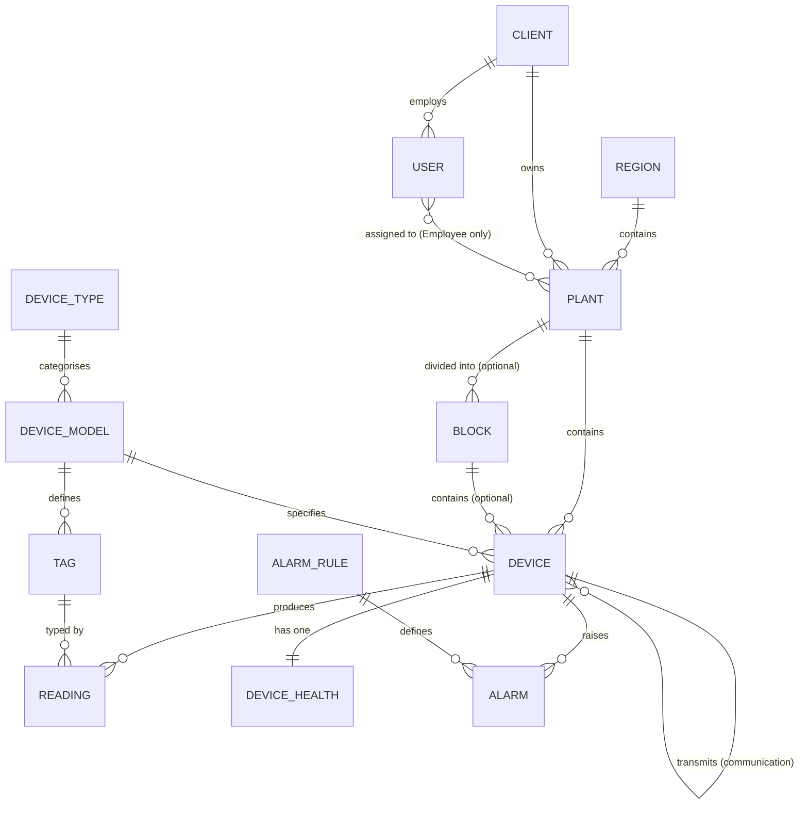
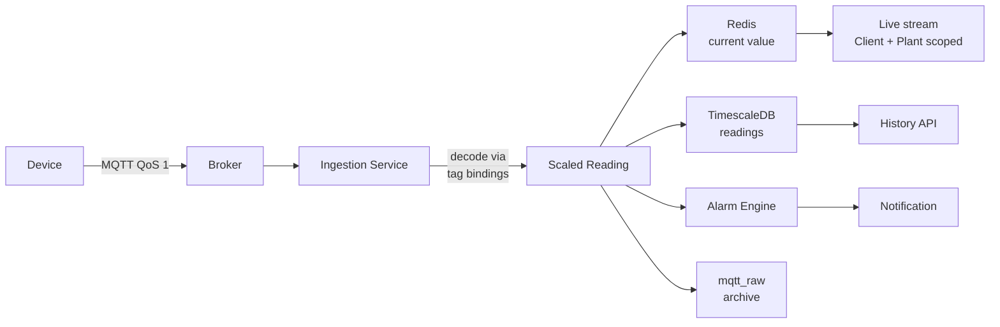
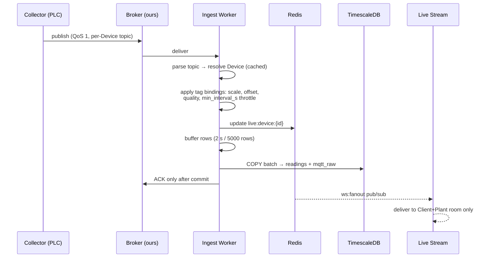
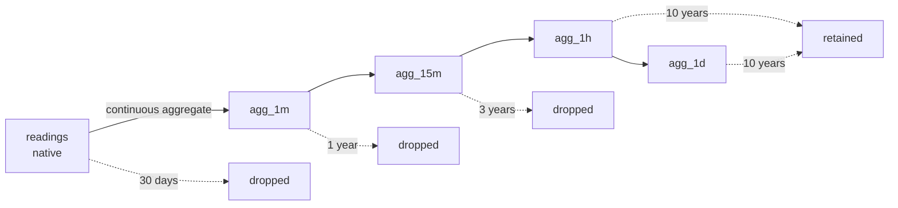
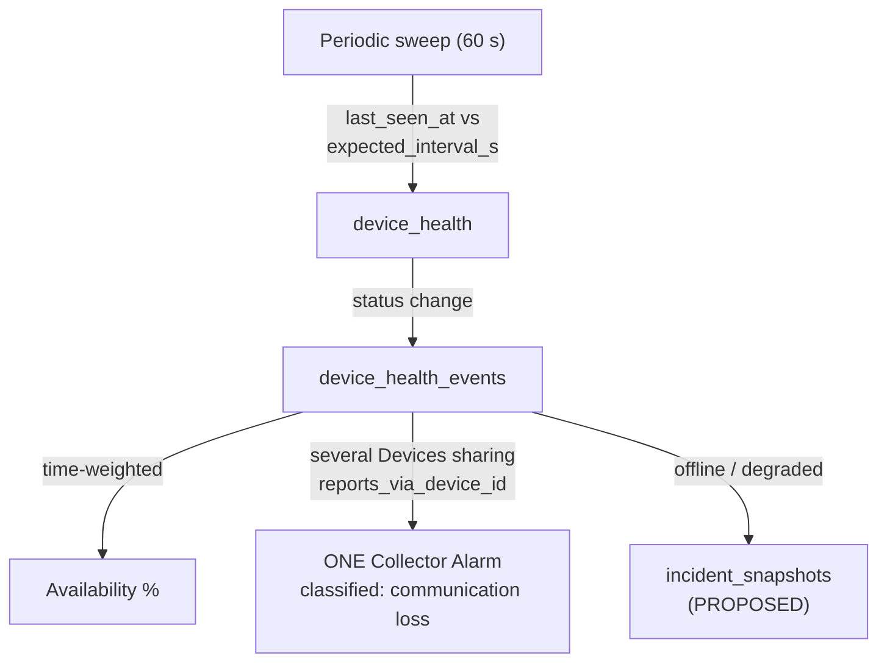
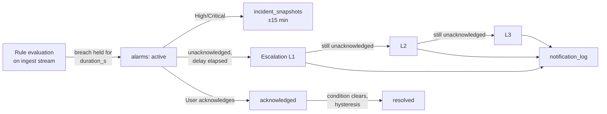
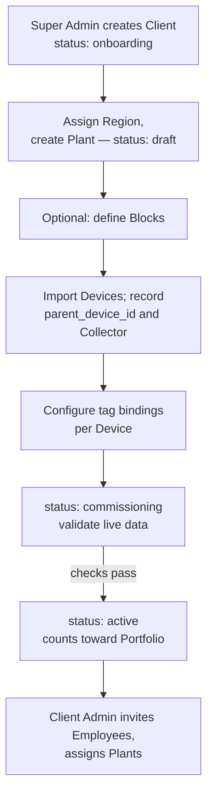
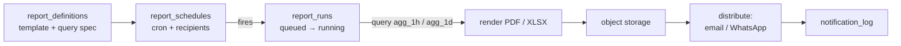
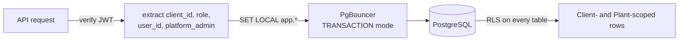

# SolarCMS — Master Specification

**Version:** 2.7 · **Date:** 17 September 2026 · **Status:** Living document

This document is authoritative. Where any other document, diagram, database schema, or conversation disagrees with it, **this document is correct and the other artefact must be corrected**. Nothing here is implied or assumed — every statement carries an explicit status marker.

**Supersedes:** `SINGLE_SOURCE_OF_TRUTH.md` v1.4 and `PLATFORM_ARCHITECTURE.md`. Both are absorbed in full; neither should be cited again.

---

## 0. How To Read This Document

### 0.1 Decision status markers

These describe **who decided**, not whether it is built.

| Marker | Meaning |
|---|---|
| **CONFIRMED** | Decided by the client. Not open to revision without a new client instruction. |
| **AGREED** | Decided during design work and internally consistent. Has not been put to the client. |
| **PROPOSED** | Recommended by engineering. Awaiting a decision. Do not build against it. |
| **OPEN** | A known question with no answer. Listed in §8. |
| **SUPERSEDED** | Was decided, then replaced. The replacement is named. |

### 0.2 Implementation status markers

These describe **whether it exists**, not whether it is decided.

| Marker | Meaning |
|---|---|
| **BUILT** | Exists and runs. |
| **IN SCHEMA** | Definition written in `backend/schema/001_core_schema.sql`. No application code uses it. |
| **SPECIFIED** | Definition written in this document but not in any schema file. |
| **NOT BUILT** | Described only in prose. No definition exists anywhere. |

⚠ Note on **IN SCHEMA**: `backend/schema/001_core_schema.sql` predates this document and uses superseded names (`tenants`, `tag_definitions`, `alarm_events`) and a retired `locations` table. It is a **reference sketch, not a migration**. Read it for intent only.

### 0.3 Precedence between documents

| Rank | Document | Authority |
|---|---|---|
| 1 | **This document** | Authoritative on vocabulary, decisions, data model, scope, and status |
| 2 | `BACKEND_SPEC.md` | Authoritative on *implementation* — structure, libraries, endpoints, build order. Subordinate to this document on all facts |
| 3 | `TAG_CATALOGUE.md` | The client's own Device List and signal schedule. Authoritative on **units** for the Device Types it covers; silent on scaling and ranges |
| 4 | `BROKER_OBSERVATIONS.md` | Observed behaviour of the client's test broker. Evidence of *shape*, never of meaning (§5.4) |
| 5 | `HIGH_LEVEL_DESIGN.md` | Non-technical explanation for stakeholders. Explanatory only, never authoritative. **Predates v2.0 — contains stale terminology** |
| 6 | `backend/schema/001_core_schema.sql` | Historical sketch. Superseded names throughout |
| 7 | `SINGLE_SOURCE_OF_TRUTH.md`, `PLATFORM_ARCHITECTURE.md`, `solar_architecture_specification*.md` | **SUPERSEDED.** Retain for history. Do not cite |

---

## 1. Ubiquitous Language

**Status: PROPOSED** — requires client sign-off before application to schema, API, and UI.

Every term below is used identically in database object names, API field names, UI labels, documentation, and speech. The "Retired" column lists words that must **not** appear in any artefact, because each has been used for more than one concept and is therefore ambiguous.

### 1.1 Core entities

| Canonical Term | Definition (exact) | Database Object | API Field | UI Label | Retired Synonyms |
|---|---|---|---|---|---|
| **Client** | A customer company that owns one or more Plants. The unit of data isolation. | `clients` | `client_id` | "Client" | tenant, company, organisation, customer, account |
| **Plant** | One physical generation site. Belongs to exactly one Client. | `plants` | `plant_id` | "Plant" | site, facility, installation, project |
| **Block** | An optional, Client-defined subdivision of a Plant. See §2.2. | `blocks` | `block_id` | "Block" | zone, section, array, sub-plant |
| **Device** | One physical piece of equipment installed at a Plant. | `devices` | `device_id` | "Device" | equipment, asset, unit, hardware |
| **Device Type** | The category a Device belongs to. Extensible; not a fixed list. | `device_types` | `device_type_id` | "Device Type" | equipment type, category, class |
| **Device Model** | The specific make and model of a Device. E.g. Sungrow SG250HX. | `device_models` | `device_model_id` | "Model" | equipment, make, product |
| **Tag** | One measurable quantity a Device Model can report. E.g. AC Active Power. | `tags` | `tag_id` | "Tag" | parameter, metric, point, signal, measurement |
| **Reading** | One value of one Tag, from one Device, at one instant. | `readings` | — | "Reading" | data point, sample, telemetry value |
| **Region** | A state or geographic grouping that Plants belong to. | `regions` | `region_id` | "Region" | state, territory, zone, area |
| **Collector** | The publishing endpoint that transmits Readings for one or more Devices. Typically a PLC. | *a Device, referenced by* `reports_via_device_id` | `collector_code` | "Collector" | logger, gateway, RTU |
| **Portfolio** | The set of all Plants visible to the current User. **Computed, never stored.** | *(none)* | — | "Portfolio" | fleet, group, estate |

### 1.2 Operational concepts

| Canonical Term | Definition (exact) | Database Object | UI Label | Retired Synonyms |
|---|---|---|---|---|
| **Alarm** | A single occurrence of a condition that breached an Alarm Rule. | `alarms` | "Alarm" | alert, event, incident, warning |
| **Alarm Rule** | A configured condition that raises an Alarm when breached. | `alarm_rules` | "Alarm Rule" | trigger, threshold, condition |
| **Notification** | One delivery attempt of an Alarm or Report to one recipient via one channel. | `notification_log` | "Notification" | alert, message, email, push |
| **Escalation** | Automatic re-notification to a higher level after an Alarm stays unacknowledged. | `escalation_policies`, `escalation_steps` | "Escalation" | chain, ladder, tier |
| **Device Health** | The current communication and data-quality state of a Device. Distinct from its Readings. | `device_health` | "Status" | connectivity, comms status, uptime |
| **Report** | A generated document covering a defined scope and period. | `report_definitions`, `report_runs` | "Report" | export, statement, summary |
| **Audit Record** | An immutable log entry of a user action or configuration change. | `audit_log` | "Audit Trail" | log, history, activity, trace |

### 1.3 Abbreviations

Permitted **only** in Device codes and schema comments. All user-facing text uses the full term.

| Abbreviation | Canonical Term |
|---|---|
| MFM | Meter |
| SMB | String Box |
| WMS | Weather Station |
| INV | Inverter |
| VCB | Vacuum Circuit Breaker |
| PPC | Power Plant Controller |
| ABT | Availability Based Tariff |
| SLDC | State Load Despatch Centre |
| SLD | Single Line Diagram *(after one full-term use)* |
| PR | Performance Ratio |
| CUF | Capacity Utilisation Factor |

### 1.4 Renames required

**Status: PROPOSED** (OPEN-5). The reference schema uses names that differ from the canonical terms. Ubiquitous language requires the database to match the spoken word. All are free today — no application code reads these tables and no data exists — and permanently expensive after go-live.

| Current name | Canonical name | Reason |
|---|---|---|
| `tenants` | `clients` | Nobody says "tenant" in a client meeting. The word appears in no requirement document. |
| `tag_definitions` | `tags` | The client's own application, SQL Server table, and engineers all say "Tag" (§9.3). Resolves OPEN-1 toward the domain experts' word. |
| `device_tag_bindings` | *unchanged* | Already correct under the Tag decision. |
| `alarm_events` | `alarms` | "Event" is used elsewhere for Device Health transitions. Two meanings, one word. |

---

## 2. Confirmed Facts

**Every row is CONFIRMED by the client.** Nothing here may be changed by engineering judgement.

| # | Fact |
|---|---|
| F-1 | Current scale is 200 MW across 92 Devices. |
| F-2 | Designed to a ceiling of 300 MW and 150+ Devices, permitting gradual growth without re-architecture. |
| F-3 | **All data arrives via MQTT only.** No REST-poll ingestion. No SQL Server pull ingestion. |
| F-4 | The historical database is PostgreSQL with TimescaleDB. |
| F-5 | Redis is in scope, for serving current values to the analytics dashboard quickly. |
| F-6 | One Client may own multiple Plants. |
| F-7 | A Client-side User is either an **Admin** or an **Employee**. |
| F-8 | A Client Admin can see all Plants owned by that Client. |
| F-9 | A Client Employee can see only the Plants they are explicitly assigned to. |
| F-10 | A **Guest** role exists, separate from Admin and Employee, for demonstrating the system. |
| F-11 | A **Super Admin** can see all Clients and all their Plants. |
| F-12 | Device Types are not limited to the initial four. More will be added. |
| F-13 | Historical data is retained for a minimum of 10 years. |
| F-14 | Dashboards are configuration-driven. Separate dashboards must **not** be developed per Plant. |
| F-15 | A Client Admin holds `plant.manage` — may create Plants and Devices, and therefore issue broker credentials, **scoped to their own Client only** (I-9). |
| F-16 | The client publishes all data to MQTT. Any upstream OPC, SQL Server, or REST pipeline they operate is **their** responsibility and terminates before our boundary. **Our scope begins at the broker.** |
| F-17 | **We deploy and operate the production broker.** The client publishes into it. Pushing data is theirs; operating the broker is ours. |
| F-18 | The client publishes **per-Device** Readings, for every Device at every Plant — not Plant-level totals. |
| F-19 | Historical data accumulates **from go-live**. No back-loading. F-13 is forward-looking only. |

### 2.0.1 Consequences worth stating

**F-3 versus the evidence.** §9 shows the client currently runs an OPC → SQL Server → REST pipeline, which appeared to contradict F-3. **F-3 is upheld** — that pipeline is upstream of our boundary. The tender's REST API and SQL Server clauses remain out of scope (OPEN-7).

**F-16 governs transport, not content.** §9 describes what the client's systems *hold*. Changing transport to MQTT does not change what is in the payload. OPEN-14 through OPEN-16 concern content and are unaffected.

**F-17 makes the topic format ours to specify** and hand to the client, not negotiate. We also own credentials, access rules, TLS, and broker uptime. The boundary is the broker's ingress — monitoring must sit on **both** sides of it, so "data stopped" can be attributed to their publisher or our broker without argument.

⚠ **Transition risk.** The client currently operates a test broker that we subscribe to; production reverses this. **The §5.1 topic format must be agreed and used on the test broker now**, or development happens against one shape of data and is rewritten for another.

**F-18 makes tender §8 achievable** (per-Inverter monitoring, comparison, ranking). Note §9 showed solar Plants publishing Plant-level totals only — F-18 is therefore a change on the client's side, not a description of the sample.

**F-19 removes a substantial risk.** Migrating a decade of Readings would have been a separate project: extraction, historical Tag-name mapping, gap reconciliation. None required.

### 2.1 Hierarchy

**Status: CONFIRMED.**

```
Portfolio → Region / State → Client → Plant → Block / Zone → Device → Tag
```

| Level | Canonical Term | Stored As | Implementation |
|---|---|---|---|
| 1 | Portfolio | *(computed — never stored)* | n/a by design |
| 2 | Region | `regions` | SPECIFIED — build it |
| 3 | Client | `clients` | IN SCHEMA *(as `tenants`)* |
| 4 | Plant | `plants` | IN SCHEMA |
| 5 | Block | `blocks` | SPECIFIED — build it |
| 6 | Device | `devices` | IN SCHEMA |
| 7 | Tag | `tags` | IN SCHEMA *(as `tag_definitions`)* |

**SUPERSEDED and retired:** an earlier nine-level hierarchy with *Location* between Plant and Block, and *Equipment* between Block and Device. **The `locations` table is retired entirely — do not build it.** Block covers the client-defined-subdivision case Location was intended for. Equipment classification lives on `device_models` / `device_types` as Device attributes, not as a hierarchy level.

### 2.2 What a Block is, exactly

**Status: CONFIRMED.**

A Block is a **subdivision of a Plant that the Client defines for their own convenience** — "North Zone", "South Block", "Phase 2". Nothing more.

| Property | Rule |
|---|---|
| Optional | A Plant may have zero Blocks. Devices then attach directly to the Plant. |
| Client-named | Names are arbitrary and chosen by the Client. The system never interprets them. |
| Flat | A Block has **no sub-Blocks**. One level only; no self-reference. |
| Geographic, not electrical | Describes *where* equipment is, or how the Client groups it. Carries no electrical meaning and is **not** part of the Single Line Diagram. |
| Carries capacity | `blocks.capacity_kwp` is required so PR, CUF and specific yield are reportable per Block. A Client who defines zones will want zone-level performance. |
| Not an access boundary | Plant Assignment stays Plant-level per F-9. No Block-level visibility scoping. |

### 2.3 Device Type catalogue

**Status: CONFIRMED** — supplied by the client. Supersedes the provisional four-type list.

`In Power Path` determines Single Line Diagram membership. Devices outside the power path are real, monitored Devices, but electricity does not flow through them; placing them in the electrical tree would corrupt the diagram.

| Device Type | Full name | In Power Path | Variants |
|---|---|:--:|---|
| `VCB` | Vacuum Circuit Breaker | Yes | — |
| `ISOLATOR` | Isolator / Disconnector | Yes | — |
| `INVERTER` | Inverter | Yes | **`central`**, **`string`** |
| `SMB` | String Monitoring Box | Yes | — |
| `TRANSFORMER` | Transformer | Yes | **`two_winding`**, **`three_winding`** |
| `MFM` | Multi-Function Meter | Yes | — |
| `ABT_METER` | Availability Based Tariff Meter | Yes | — |
| `WMS` | Weather Monitoring Station | No | — |
| `PPC` | Power Plant Controller | No | — |
| `MODULE_TRACKER` | Module Tracker | No | — |
| `UPS` | Uninterruptible Power Supply | No | — |
| `DC_POWER_BANK` | DC Power Bank | No | — |
| `FIRE_SYSTEM` | Fire Detection / Suppression System | No | — |
| `ANNUNCIATOR` | Annunciator Panel | No | — |
| `SLDC_TELEMETRY` | SLDC Telemetry Unit | No | — |
| `MCR_SECTION` | Main Control Room Section | **OPEN-12** | — |
| `ICR_SECTION` | Inverter Control Room Section | **OPEN-12** | — |

*The client's earlier list gave transformer variants as "2 binding" and "3 binding". The correct term is **winding**, and the signal schedule of 10 Sep 2026 now says `2 WINDING/3 WINDING` — corrected at source.*

**Re-confirmed 10 September 2026.** The client's Device List reproduces these 17 Types exactly, with no additions or removals (`TAG_CATALOGUE.md` §1). Their spelling `ISOLATER` is a spreadsheet slip; the canonical term remains `ISOLATOR`.

**OPEN-12 is all but answered.** `MCR SECTION` and `ICR SECTION` appear in a *Device* List, and the schedule instantiates VCBs and MFMs against sections labelled `IC-1/OG-2` — Incomer and Outgoing feeder positions in a switchboard. They are switchgear sections carrying feeders, so they are Devices **in the power path**, with their VCBs and MFMs beneath them via `parent_device_id`. One written confirmation closes it (T-9).

**Variants belong to the Device Model, not the Device.** A given product is always one or the other — a Sungrow SG250HX is always a string inverter. The variant determines which Tags exist and which Single Line Diagram shape is valid; both are Model-level facts.

Two Device Types carry consequences elsewhere:

- **`ABT_METER` is the settlement instrument** — legally sealed, revenue-grade. `MFM` is operational monitoring. **Financial Reports must be calculated from ABT Meter Readings, never MFM Readings.** They differ in accuracy class and only one has commercial standing.
- **`PPC` is the source of curtailment data.** Tender §18 requires Curtailment as a distinct loss category. The Power Plant Controller receives grid setpoints and adjusts Inverters, so it alone knows a reduction was *commanded* rather than a fault.

---

## 3. Domain Model

### 3.1 Entity relationships



### 3.2 Complete entity register

| Entity | Canonical Term | Decision | Implementation |
|---|---|---|---|
| `clients` | Client | CONFIRMED | IN SCHEMA *(as `tenants`)* |
| `users` | User | CONFIRMED | IN SCHEMA |
| `roles` | Role | CONFIRMED | IN SCHEMA |
| `permissions`, `role_permissions` | Permission | AGREED | IN SCHEMA |
| `memberships` | *(links User to Client)* | AGREED | IN SCHEMA |
| `user_plant_access` | Plant Assignment | CONFIRMED | IN SCHEMA |
| `regions` | Region | CONFIRMED | SPECIFIED — §3.6 |
| `blocks` | Block | CONFIRMED | SPECIFIED — §3.6 |
| ~~`locations`~~ | *(retired)* | SUPERSEDED | **Do not build** |
| `device_types` | Device Type | CONFIRMED | IN SCHEMA *(needs `in_power_path`, `variant_set`)* |
| `device_models` | Device Model | AGREED | IN SCHEMA *(needs `variant`)* |
| `tags` | Tag | CONFIRMED | IN SCHEMA *(as `tag_definitions`; needs `category`, `min_interval_s`)* |
| `plants` | Plant | CONFIRMED | IN SCHEMA *(needs `region_id`)* |
| `devices` | Device | CONFIRMED | IN SCHEMA *(needs `block_id`, `reports_via_device_id`)* |
| `device_tag_bindings` | Tag Binding | AGREED | IN SCHEMA |
| `readings` | Reading | CONFIRMED | IN SCHEMA *(needs `source_time`)* |
| `mqtt_raw` | Raw Payload Archive | AGREED | IN SCHEMA |
| `agg_1m` | 1-Minute Summary | AGREED | NOT BUILT |
| `agg_15m`, `agg_1h`, `agg_1d` | Summary | AGREED | IN SCHEMA |
| `device_health` | Device Health | AGREED | IN SCHEMA |
| `device_health_events` | Health Transition | AGREED | IN SCHEMA |
| `alarm_rules` | Alarm Rule | CONFIRMED | IN SCHEMA |
| `alarms` | Alarm | CONFIRMED | IN SCHEMA *(as `alarm_events`)* |
| `escalation_policies`, `escalation_steps` | Escalation | AGREED | SPECIFIED — §3.6 |
| `notification_subscriptions` | Notification Preference | AGREED | IN SCHEMA |
| `notification_log` | Notification | AGREED | SPECIFIED — §3.6 |
| `dashboards`, `user_dashboard_access` | Dashboard Assignment | AGREED | SPECIFIED — §3.6 |
| `incident_snapshots` | Incident Snapshot | PROPOSED | SPECIFIED — §3.6 |
| `report_definitions`, `report_schedules`, `report_runs` | Report | AGREED | IN SCHEMA |
| `audit_log` | Audit Record | CONFIRMED | IN SCHEMA |

### 3.3 Invariant rules

**Status: AGREED.** These must hold at all times. Violating any breaks a CONFIRMED requirement.

| # | Rule | Protects |
|---|---|---|
| I-1 | No table, column, or code path is named after a specific Client, Plant, or Device. | F-14 |
| I-2 | No Tag is ever a database column. Tags are rows in `tags`. | F-12, F-14 |
| I-3 | A Device's parent Device must belong to the same Plant. | Single Line Diagram integrity |
| I-4 | Every Client-owned table carries `client_id` and is protected by database-enforced row-level access control. | F-6, F-8, F-9, F-11 |
| I-5 | An Employee with zero Plant Assignments sees zero Plants. Absence of assignment is never full access. | F-9 |
| I-6 | A Guest may only be granted access to a Client flagged as a demonstration Client. | F-10 |
| I-7 | Data ingestion runs as a process separate from the API. | Ingestion must survive API deployment |
| I-8 | Live data streams are scoped per Client and per Plant. Broadcast to all connected users is prohibited. | F-6, F-8, F-9 |
| I-9 | A credential issued by a Client Admin may only be scoped to Plants owned by that Client. | F-15 |
| I-10 | Geographic placement, electrical connection, and communication routing are **three separate relationships**. No column may express another's meaning. | §3.4 |
| I-11 | Financial Reports are computed from ABT Meter Readings, never MFM Readings. | §2.3 |

### 3.4 The three groupings of a Device

**Status:** `block_id` CONFIRMED · `parent_device_id` CONFIRMED · `reports_via_device_id` PROPOSED (OPEN-8).

Every Device belongs to three groupings answering three unrelated questions. They are frequently *not* the same shape, and collapsing any two makes both unanswerable.

| Column | Question | Nature | Used for |
|---|---|---|---|
| `block_id` | **Where is it?** | Geographic | Zone-level KPIs, filtering, navigation |
| `parent_device_id` | **What is it wired into?** | Electrical | Single Line Diagram |
| `reports_via_device_id` | **What transmits it?** | Communication | Credential scope, collector-failure correlation |

A North Zone Inverter may be wired to a Meter shared with South Zone Inverters, and transmitted by a PLC covering both zones. Three different answers for one Device.

**Consequence if `reports_via_device_id` is omitted:** when a Collector fails, every Device it transmits goes silent simultaneously while the equipment continues generating normally. The system then raises one Alarm per silent Device with no indication they share a cause and — more seriously — **records a communication failure as generation downtime**, corrupting the availability figures that performance guarantees are calculated from. Tender §18 lists Communication Loss and Equipment Downtime as *separate* categories; the distinction is unbuildable without this column.

### 3.5 Design rationale

**Status: AGREED.** Why the model is shaped as it is. Each of these is load-bearing.

**`readings` is narrow** — `(time, client_id, device_id, tag_id, value, quality, source_time)`, not a column per metric. Device Models expose different Tag sets: a Weather Station has no voltage, a String Box has no irradiance, a three-winding Transformer reports three windings where a two-winding reports two. A wide table would be mostly NULL and every new Device Model would require a migration. This is I-2, and it is the single decision that makes F-12 and F-14 possible.

**`client_id` is deliberately denormalised onto `readings`** — redundant with `devices → plants → clients`, but it lets row-level security and chunk pruning work without a three-table join on every historical query. The cost is a few bytes per row that compression largely erases.

**`tags` is the canonical metric registry** — every value the platform can display, alarm on, or report is a row there. Adding a metric is an `INSERT`. Each Tag carries its own `rollup_method` (`avg` for power, `last` for cumulative counters, `max` for peaks) because a continuous aggregate cannot infer that from the value alone. Averaging a cumulative energy counter is meaningless.

**`device_tag_bindings` is per-Device, not per-Model.** The Model's Tag defaults are a template; bindings record what a specific Device was *actually* wired as, because field wiring never matches the datasheet. Worked example in §5.2.

**Row-level security enforces isolation, not application code.** The argument is defensibility: a developer who forgets a `WHERE client_id = …` clause gets zero rows, not another Client's generation data. That is a claim worth being able to make to a client. ⚠ **PgBouncer must run in transaction mode** — statement mode leaks the session variable between Clients and defeats the entire model.

**Super Admin is not a Client member.** `users.platform_role = 'super_admin'` sits outside `memberships` entirely; access is granted by a policy predicate, not by rows granting membership of every Client.

**A dashboard position is a slot, not a Tag.** Plants are wired differently — one evacuates through an MCR section fed by two ICR sections, another is a rooftop array whose entire AC side is a net meter — and the dashboard is nonetheless the same screen for all of them, because what varies is not *which* figures matter but *which Device is in a position to report them*. A **slot** (`kpi.current_power`) owns an ordered list of **candidates**, each naming a Device *Type*, a Tag and an aggregation; the first the Plant is actually bound for wins. Three consequences are load-bearing. Candidates name a Type, never a Device or a Plant, so a Plant with three MFMs and a Plant with one resolve through the same row (Guardrail 2). Resolution is planned against *bindings* and only then read against *current values*, which is what separates "this Plant has no settlement meter" from "the settlement meter has gone quiet" — the same blank tile, and entirely different phone calls. And provenance travels with the value, because 6.32 MW measured by a settlement meter and 6.32 MW summed from twelve Inverters are different claims, and whoever is deciding whether to trust the number needs to know which. `PLANT_ENERGY_SOURCE_PRECEDENCE` is this idea applied to one figure by hand; the catalogue generalises it and imports those tuples rather than restating them.

**The Single Line Diagram has two projections, and both are needed.** `parent_device_id` gives the *true* electrical tree, one box per Device, which is the view that answers "which Inverter is the broken one". `device_types.sld_stage` gives the *fixed* four-stage spine — **PV Array → Inverters → Transformer → Grid**, always four, always in that order — which is the view that answers "is this Plant healthy, and how does it compare with the next one". An operator cannot compare two Plants across two differently-shaped diagrams, which is what deriving the shape from the wiring necessarily produces. Every power-path Device folds into exactly one stage by its Type; a stage with nothing in it still renders, marked not instrumented, because on a rooftop Plant that is normal and on an 8 MW Plant it means a Device nobody registered — and hiding it would conceal the second case in order to tidy up the first.

**Alarm deduplication** via a partial unique index on `(rule_id, device_id) WHERE state IN ('active','acknowledged')`. A fault persisting six hours produces one row, not thousands.

### 3.6 DDL for SPECIFIED tables

**Status: as marked per table.** None of these exist in any schema file. Names below are canonical (§1.1), not the reference sketch's.

```sql
-- ── Region (CONFIRMED) ──────────────────────────────────────────────────────

CREATE TABLE regions (
    id          BIGINT GENERATED ALWAYS AS IDENTITY PRIMARY KEY,
    code        TEXT        NOT NULL UNIQUE,        -- 'IN-UP', 'IN-HP'
    name        TEXT        NOT NULL,               -- 'Uttar Pradesh'
    country     TEXT        NOT NULL DEFAULT 'IN',
    grid_emission_factor_kg_per_kwh NUMERIC(6,4),   -- CO2-avoided; varies by grid
    created_at  TIMESTAMPTZ NOT NULL DEFAULT now()
);

ALTER TABLE plants ADD COLUMN region_id BIGINT REFERENCES regions(id);


-- ── Block (CONFIRMED) — hangs directly off Plant. No locations level. ───────

CREATE TABLE blocks (
    id           BIGINT GENERATED ALWAYS AS IDENTITY PRIMARY KEY,
    client_id    BIGINT        NOT NULL REFERENCES clients(id) ON DELETE RESTRICT,
    plant_id     BIGINT        NOT NULL REFERENCES plants(id)  ON DELETE CASCADE,
    code         TEXT          NOT NULL,            -- 'NORTH-ZONE'
    name         TEXT          NOT NULL,            -- 'North Zone'
    capacity_kwp NUMERIC(10,2) NOT NULL,            -- required: enables per-Block PR/CUF
    UNIQUE (plant_id, code)
);
-- No parent_block_id. Blocks are flat (§2.2).


-- ── The three groupings + catalogue columns (§3.4, §2.3) ────────────────────

ALTER TABLE devices ADD COLUMN block_id              BIGINT REFERENCES blocks(id);
ALTER TABLE devices ADD COLUMN reports_via_device_id BIGINT REFERENCES devices(id);

ALTER TABLE devices ADD CONSTRAINT uq_device_plant UNIQUE (id, plant_id);
ALTER TABLE devices ADD CONSTRAINT fk_parent_same_plant
    FOREIGN KEY (parent_device_id, plant_id) REFERENCES devices (id, plant_id);   -- I-3

ALTER TABLE device_types  ADD COLUMN in_power_path BOOLEAN NOT NULL DEFAULT false;
ALTER TABLE device_types  ADD COLUMN variant_set   TEXT[];
ALTER TABLE device_models ADD COLUMN variant       TEXT;

ALTER TABLE tags ADD COLUMN category TEXT NOT NULL DEFAULT 'performance'
    CHECK (category IN ('performance','electrical','diagnostic','environmental','status'));
ALTER TABLE tags ADD COLUMN min_interval_s INT NOT NULL DEFAULT 60;

ALTER TABLE readings ADD COLUMN source_time TIMESTAMPTZ;   -- device clock; tender §28
-- readings.time remains the authoritative index column = receipt time

ALTER TABLE device_health SET (                            -- hot 150-row table
    autovacuum_vacuum_scale_factor = 0.0,
    autovacuum_vacuum_threshold    = 50
);


-- ── Dashboard-level access (AGREED) — tender §30 ────────────────────────────
-- Independent of user_plant_access: which dashboard TYPES a User may open at
-- all. Enforced in the API route guard, never only by hiding a nav item.

CREATE TABLE dashboards (
    id          BIGINT GENERATED ALWAYS AS IDENTITY PRIMARY KEY,
    code        TEXT NOT NULL UNIQUE,   -- 'portfolio', 'plant_overview',
    name        TEXT NOT NULL,          -- 'single_plant', 'inverter_monitoring', …
    sort_order  INT  NOT NULL DEFAULT 0
);

CREATE TABLE user_dashboard_access (
    membership_id BIGINT NOT NULL REFERENCES memberships(id) ON DELETE CASCADE,
    dashboard_id  BIGINT NOT NULL REFERENCES dashboards(id)  ON DELETE CASCADE,
    PRIMARY KEY (membership_id, dashboard_id)
);
-- No rows + role = 'admin'  → all dashboards.
-- No rows otherwise         → no dashboards. Deny by default (cf. I-5).


-- ── Escalation (AGREED) — tender §23 ────────────────────────────────────────

CREATE TABLE escalation_policies (
    id           BIGINT GENERATED ALWAYS AS IDENTITY PRIMARY KEY,
    client_id    BIGINT  NOT NULL REFERENCES clients(id) ON DELETE CASCADE,
    name         TEXT    NOT NULL,
    scope_type   TEXT    NOT NULL CHECK (scope_type IN ('client','plant')),
    scope_id     BIGINT,                                 -- plant_id when scope_type='plant'
    min_severity TEXT    NOT NULL DEFAULT 'high'
                 CHECK (min_severity IN ('critical','high','medium','low')),
    enabled      BOOLEAN NOT NULL DEFAULT true
);

CREATE TABLE escalation_steps (
    id             BIGINT GENERATED ALWAYS AS IDENTITY PRIMARY KEY,
    policy_id      BIGINT NOT NULL REFERENCES escalation_policies(id) ON DELETE CASCADE,
    level          INT    NOT NULL,        -- 1, 2, 3…
    delay_minutes  INT    NOT NULL,        -- unacknowledged time before this step fires
    notify_user_id BIGINT REFERENCES users(id),   -- preferred: a named person
    notify_role_id BIGINT REFERENCES roles(id),   -- coarse fallback
    channel        TEXT   NOT NULL CHECK (channel IN ('email','whatsapp','sms')),
    UNIQUE (policy_id, level)
);
```

⚠ **Escalation and the four-role model.** Tender §23's example escalates Operator → Plant Manager → Management — three distinct roles. The CONFIRMED role model (F-7) has only **Admin** and **Employee** on the client side, so three levels cannot be expressed by role alone. Escalation must therefore be driven primarily by `notify_user_id` (named people), with `notify_role_id` as a coarse fallback. This is a direct consequence of the four-role decision and should be raised alongside OPEN-2.

```sql
-- ── Notification history (AGREED) — tender §24 ──────────────────────────────

CREATE TABLE notification_log (
    id                BIGINT GENERATED ALWAYS AS IDENTITY PRIMARY KEY,
    client_id         BIGINT      NOT NULL,
    alarm_id          BIGINT      REFERENCES alarms(id) ON DELETE SET NULL,
    report_run_id     BIGINT      REFERENCES report_runs(id) ON DELETE SET NULL,
    recipient_user_id BIGINT      REFERENCES users(id),
    channel           TEXT        NOT NULL CHECK (channel IN ('email','whatsapp','sms')),
    message           TEXT        NOT NULL,
    escalation_level  INT,                            -- NULL if not from an Escalation Step
    sent_at           TIMESTAMPTZ NOT NULL DEFAULT now(),
    delivery_status   TEXT        NOT NULL DEFAULT 'queued'
                      CHECK (delivery_status IN ('queued','sent','delivered','failed')),
    failure_reason    TEXT
);
CREATE INDEX idx_notification_log_client ON notification_log (client_id, sent_at DESC);


-- ── Incident evidence (PROPOSED — OPEN-6) ───────────────────────────────────
-- Freezes the raw Reading window around a High/Critical Alarm to object storage
-- before 30-day raw retention (§5.3) ages it out.

CREATE TABLE incident_snapshots (
    id               BIGINT GENERATED ALWAYS AS IDENTITY PRIMARY KEY,
    client_id        BIGINT      NOT NULL,
    alarm_id         BIGINT      REFERENCES alarms(id) ON DELETE SET NULL,
    device_id        BIGINT      NOT NULL REFERENCES devices(id),
    window_start     TIMESTAMPTZ NOT NULL,            -- ~15 min before trigger
    window_end       TIMESTAMPTZ NOT NULL,            -- ~15 min after
    devices_included BIGINT[]    NOT NULL,            -- faulted + siblings + parent + WMS
    artifact_url     TEXT,
    row_count        INT,
    state            TEXT        NOT NULL DEFAULT 'queued'
                     CHECK (state IN ('queued','captured','failed')),
    captured_at      TIMESTAMPTZ
);
```

### 3.7 Dropped from consideration

**`data_source_connections`** — proposed while REST and SQL Server ingestion were in scope, to decouple "how does this Device's data arrive" from the Device row. **Dropped** once F-3 confirmed MQTT-only: `devices.source_address` already *is* that mapping (the MQTT topic), leaving the abstraction nothing to do.

**`locations`** — see §2.1. Retired; Block covers the case.

**A drag-and-drop dashboard builder** — the shape the incumbent product takes, and the obvious answer to "every Plant is different". **Dropped.** A canvas makes each Plant a bespoke artefact that somebody has to build before the Plant is usable and that nobody can compare against another; two Plants laid out by two engineers answer the same question in two places, and a Portfolio view over them is not possible at all. It also moves the decision about *what a number means* to whoever last dragged a tile. Replaced by slot resolution (§3.5): the layout is fixed in code, the sources are configuration, and per-Plant deviation is a row in `plant_dashboard_slot_overrides` carrying a `note` saying why — expected to be empty for almost every Plant. That it is usually empty is precisely what distinguishes it from a per-Plant dashboard, which Guardrail 2 forbids.

---

## 4. Roles and Access

### 4.1 Role definitions

**Status: CONFIRMED** (F-7, F-10, F-11).

| Role | Belongs To | Plant Visibility | Set By |
|---|---|---|---|
| **Super Admin** | The platform operator, not a Client | Every Plant of every Client | Platform |
| **Admin** | One or more Clients | Every Plant owned by that Client, automatically | Super Admin |
| **Employee** | Exactly one Client | Only explicitly assigned Plants. Zero assignments means zero Plants. | Client Admin |
| **Guest** | A demonstration Client only | Only demonstration Plants. Never real Client data. | Super Admin |

**SUPERSEDED:** an earlier role set of *Administrator, Operator, Management, Read-Only*. **See OPEN-2** — the tender names that five-role set, which conflicts with F-7.

### 4.2 The four independent access dimensions

**Status: AGREED.** Four separate questions. A User must pass all four.

| # | Dimension | Question | Mechanism |
|---|---|---|---|
| A-1 | Client | Which Client's data may this User reach at all? | `memberships` |
| A-2 | Plant | Within that Client, which Plants? | Role = Admin → all. Otherwise `user_plant_access` |
| A-3 | Dashboard | Which dashboards may this User open? | `user_dashboard_access` |
| A-4 | Action | What may this User do with what they can see? | `roles` → `role_permissions` → `permissions` |

All four are enforced at the API **and** database layers. Hiding a menu item is not an access control and satisfies none of them.

### 4.3 Action permissions

**Status: AGREED.** `role_permissions` composes any role from these freely — a custom role is not a schema change.

| Permission | Grants |
|---|---|
| `dashboard.view` | Open an assigned dashboard |
| `alarm.acknowledge` | Acknowledge or clear an Alarm |
| `data.export` | Export data as CSV or Excel |
| `report.generate` | Run or schedule a Report |
| `config.modify` | Change Plant, Device, or Tag configuration |
| `user.manage` | Create and edit Users, assign Roles |
| `plant.manage` | Onboard, edit, or decommission a Plant (held by Client Admin per F-15) |
| `system.admin` | Platform-level administration |

---

## 5. Data Lifecycle

### 5.1 Ingestion contract

**Status: PROPOSED.** Implementation: **NOT BUILT.** This is an interface contract with field hardware — once Devices are commissioned and publishing, changing it means revisiting every site. Settle before the first Plant goes live.

**Topic format**

```
scms/v1/{client_code}/{plant_code}/{collector_code}/{device_code}
```

Example: `scms/v1/vardhman/plant-015/plc-01/INV-01`

The topic is the **sole** means of identifying origin. The payload is never inspected to determine Client, Plant, Collector, or Device.

**The `collector_code` segment is deliberate.** It makes the communication path *self-declaring* — every message states which Collector transmitted it, so `reports_via_device_id` (§3.4) populates from the data stream rather than a hand-maintained spreadsheet, and can never drift. Where a Device publishes directly with no intermediate Collector, `collector_code` equals its own `device_code`; no special handling needed.

§9.3 shows the client's Tag names already begin `PLC1.`, so Collector identity exists in their system today. **Requires confirmation that `PLCn` denotes physical hardware rather than a naming convention — OPEN-8.**

**Credential model**

| Rule | Detail |
|---|---|
| Credential unit | One per **publishing endpoint** — whatever physically opens the broker connection. Usually a Collector transmitting for many Devices; occasionally a single Device. |
| Issued by | The CMS, automatically, when the endpoint is registered. Never created by hand in the broker. |
| Authority | The broker authenticates **against the CMS**. It holds no independent user list. Registering an endpoint creates access; decommissioning revokes it. |
| Scope | Constrained to the address space of the Plant or Client it belongs to, per I-9. |
| Disclosure | Shown once at creation, stored irreversibly. Lost credentials are regenerated, never retrieved. |

Maintaining a separate user list inside the broker guarantees drift within weeks — credentials that can publish but aren't registered, and registered Devices whose credentials were never created.

**Unknown topic handling**

A message on a topic absent from the Device register is **quarantined to `mqtt_raw` and raises an Alarm**. It is never attributed to a Client by inference. A wrong inference silently merges one Client's data into another's history.

### 5.2 Path of one Reading

**Status: AGREED.** Implementation: **NOT BUILT.**



Three independent consumers, none blocking another. **The Alarm Engine reads the stream, not the database**, so Alarm latency is unaffected by write batching.

**Worked decoding example.** A payload arrives for `INV-01` containing `pa: 1985`. That Device's binding resolves `pa → AC_ACTIVE_POWER` at scale `0.1`, giving **198.5 kW**. `INV-02` — same Model, same Plant, newer firmware — binds the *same* Tag to source key `P_ac` at scale `1.0`. Both are correct, because the binding is per-Device. This is why §3.5 insists bindings are not Model-level.

### 5.3 Retention

**Status: AGREED.** Implementation: **NOT BUILT** — the reference sketch specifies 90-day raw and no 1-minute tier.

| Tier | Resolution | Retention | Serves |
|---|---|---|---|
| `readings` | Native (1–5 s) | **30 days** | Fault investigation, warranty evidence |
| `agg_1m` | 1 minute | 1 year | Recent trends, Plant view |
| `agg_15m` | 15 minutes | 3 years | Week and month views |
| `agg_1h` | 1 hour | **10 years** | Year view, Reports |
| `agg_1d` | 1 day | **10 years** | Portfolio trends |
| `mqtt_raw` | Native | 90 days | Replay after a binding correction |

Each aggregate stores `avg_value`, `min_value`, `max_value`, `last_value`, `sample_count`. A continuous aggregate cannot branch on `tags.rollup_method`, so all four are stored and the read path selects.

**Sizing.** At 5-second publishing across 150 Devices, 30 days of raw is roughly 2.3 billion rows — about **10 GB compressed**. Full fidelity exactly where anyone would query it, with F-13's 10-year mandate carried entirely by the hourly and daily tiers.

**The gap this creates:** raw detail for an event older than 30 days is gone. **Mitigation (PROPOSED, OPEN-6):** on any High or Critical Alarm, or a Device Health transition to `offline`/`degraded`, capture the ±15-minute raw window for the faulted Device plus its siblings, parent, and local Weather Station, and freeze it to object storage before retention removes it. Severity-gated, so Low and Medium Alarms trigger nothing — keeping the cost to a few GB per year.

**`mqtt_raw` is the only path back to correct history** if a binding scale factor is later found wrong.

### 5.4 What is discoverable from the broker, and what is not

**Status: AGREED.** Recorded because "we will find that out from the data" is right for some questions and dangerously wrong for others.

| Discoverable by observing the stream | Requires the client to tell us |
|---|---|
| Whether a Tag climbs monotonically (counter) or fluctuates (instantaneous) | The **scaling factor** of each Tag. *(Units were supplied on 10 Sep 2026 — `TAG_CATALOGUE.md`. Scaling was not, and remains the dangerous half: a unit says what `11.37` means, a scale says whether the register holds `11.37`, `1137` or `11370`.)* |
| Which Devices publish, and how often | The **rollover maximum** of a counter, and whether resets are planned |
| Whether a value resets at midnight | Whether a reset is a **rollover or a meter replacement** — identical in data, opposite in meaning |
| Approximate magnitude and plausible range | Which meter's register is **commercially binding** (ABT Meter vs MFM) |
| Which Collector transmitted a Device, once `collector_code` is in the topic | Whether `PLCn` denotes **physical hardware** |
| That two Tags correlate | The client's **formula** for PR, CUF, or Availability |

**Observation reveals the _shape_ of the data. It cannot reveal _meaning_, and it cannot reveal _edge cases that have not yet occurred_.**

1. **Observation is retrospective.** It needs data already flowing, so it cannot inform decisions taken before the first Plant publishes. Everything in the right column is a blocker, not a discovery task.
2. **Edge cases surface once, in production, months later.** A mishandled counter rollover produces a single enormous negative energy value on the day it happens. There is no earlier signal.

Both are cheap to defend against — detect counter-versus-instantaneous automatically, treat any negative energy delta as suspect rather than data — but neither substitutes for the answers.

---

## 6. Workflows

**Status: AGREED.** All **NOT BUILT**.

### 6.1 Telemetry ingestion



Acknowledging only after commit means a crash causes redelivery rather than loss — which is why the batch window is 2 seconds, not 2 minutes.

### 6.2 Rollup cascade



### 6.3 Device Health detection



A Device that stops transmitting generates no message and therefore triggers nothing. **The sweep is the only mechanism that detects a silent Device.** `frozen_tag_count` catches the opposite failure: a Device reporting on schedule with a value that has not changed — a stuck sensor, which every other check reads as healthy.

### 6.4 Alarm lifecycle



| Stage | Trigger | State |
|---|---|---|
| Raise | Alarm Rule breached beyond its debounce period | `active` |
| Notify | Immediately on raise | One `notification_log` row per recipient per channel |
| Escalate | Unacknowledged past a configured delay | Next Escalation Step fires |
| Acknowledge | A User with `alarm.acknowledge` acts | `acknowledged` |
| Resolve | Condition clears past hysteresis | `resolved` |

One Alarm Rule breaching continuously on one Device produces **exactly one** Alarm, not one per Reading. Escalation is gated by `min_severity`; a Low-severity Alarm never escalates.

### 6.5 Client and Plant onboarding



| Step | Result |
|---|---|
| 1 | Client status `onboarding` |
| 2 | Plant status `draft` |
| 3 | Blocks defined, or skipped entirely (§2.2) |
| 4 | Single Line Diagram becomes renderable |
| 5 | Readings become decodable |
| 6 | Plant `commissioning` — **excluded from Portfolio totals** |
| 7 | Plant `active` — included |
| 8 | Employees gain scoped access per I-5 |

A Plant in `draft` or `commissioning` is excluded from Portfolio aggregates, so a half-mapped Plant never drags fleet PR down.

### 6.6 Reporting



Reports render from aggregate tiers, **never raw `readings`** — a monthly all-Plant Report is a query over `agg_1d`, not a scan of billions of rows. Financial Reports use ABT Meter Readings only (I-11).

### 6.7 Request-time isolation



---

## 7. Requirements Traceability

Against the tender. Clause numbers are the tender's own.

| Clause | Requirement | Status |
|---|---|---|
| §5 | Plant hierarchy | **Covered** — seven levels CONFIRMED (§2.1); `regions` and `blocks` SPECIFIED (§3.6) |
| §6 | Config-driven architecture, no per-Plant dashboards | **Covered** — `device_models` / `tags` / `parent_device_id`; enforced by I-1, I-2 |
| §7 | Dashboard set (Portfolio / Overview / List / Single Plant / SLD) | **Covered** — all five BUILT as distinct screens. ⚠ The tender does not define Overview against List; the split is PROPOSED (OPEN-23) |
| §8 | Per-Inverter monitoring, comparison and ranking | **Covered** — unblocked by F-18. ⚠ Ranking is only valid within an Inverter variant (OPEN-13) |
| §9–§11 | MFM / SMB / WMS monitoring | **Covered** — data entry against `tags`, no schema change |
| MQTT | Broker, pub/sub, QoS, TLS, reconnect | **Covered** — §5.1; we operate the broker (F-17) |
| REST API / SQL Server ingestion | — | **Out of scope** — F-3, F-16. See OPEN-7 |
| §13 | Common acquisition layer: mapping, normalisation, scaling | **Covered** — `device_tag_bindings`; MQTT-only simplifies fully |
| §14 | Max 1-minute interval, configurable polling, retry, timeout | **Covered** — `devices.expected_interval_s`, `tags.min_interval_s` |
| §15 | Good / Bad / Uncertain data quality | Partial — `readings.quality` specified; in-band `LINK_STS` (§9.7) not yet mapped |
| §17 | 10-year retention, fast retrieval, aggregation | **Covered** — §5.3 tier cascade |
| §18 | PR / CUF / Availability / losses, formulas documented | **Blocked** — OPEN-16. Inputs exist; formulas are the client's to supply |
| §18 | Curtailment as a distinct loss category | **Covered** — `PPC` is the source (§2.3) |
| §18 | Communication Loss vs Equipment Downtime as separate categories | **Depends on OPEN-8** — requires `reports_via_device_id` (§3.4) |
| §18 | CO₂ avoided | **Covered** — `regions.grid_emission_factor_kg_per_kwh` (§3.6) |
| §22 | Notification config: channel, recipient, template, priority | Partial — `notification_subscriptions` needs `priority` and `message_template` |
| §23 | Alarm escalation, configurable delay / recipient / method | SPECIFIED (§3.6). ⚠ Three levels cannot be expressed by role under the four-role model |
| §24 | Notification delivery history | SPECIFIED — `notification_log` (§3.6) |
| §25 | Full Report catalogue | **Covered by design** — `report_definitions` is generic |
| §26–§27 | Export formats, scheduling, distribution | **Covered** — `report_runs`, `report_schedules` |
| §28 | Source timestamp retained, NTP, `DD-MM-YYYY` display | **Covered** — `readings.source_time` vs `time` (§3.6); display is frontend |
| §29 | Multi-user, roles, custom roles | **Covered** — `roles` is a table, not an enum. ⚠ Conflicts with tender's five-role list: OPEN-2 |
| §30 | Per-User dashboard access, API-enforced | SPECIFIED — `dashboards` / `user_dashboard_access` (§3.6), A-3 |
| §32 | Action-level permission | **Covered** — §4.3 |
| §33 | Audit trail including login / logout / failed login | Partial — `audit_log` exists; login events need the auth flow (§8.2) |
| — | Search, filter, sort, export | **Covered by design** — falls out of existing indexes |

---

## 8. Open Items

### 8.1 Open decisions — require a client answer

**No work may proceed on any of these until resolved.**

| # | Question | Blocks | Recommendation |
|---|---|---|---|
| **OPEN-15** | What unit and scaling factor applies to each Tag? | Every displayed value, Alarm threshold, and Report | **Half answered (10 Sep 2026).** Units supplied for 7 of 17 Device Types in `TAG_CATALOGUE.md`; **scaling factors and valid ranges were not** — the sheet's Range column is blank throughout. Still blocking: a unit says what `11.37` means, a scale says whether the register holds `11.37` or `11370`. Four supplied units are also self-evidently wrong (T-4 to T-7) |
| **OPEN-16** | The client's exact formulas for PR, CUF, Availability | Tender §18; whether our figures reconcile with the client's existing reports | **PR answered (16 Sep 2026)**, in the third revision's FORMULA column: `(TODAY_ENERGY/(CUMMULATIVE GHI * DC CAPACITY)) * 100.0`. Verified against their own published figure. Built as a derived Tag. **CUF is still open** — marked "Need to Calculate" with a blank formula cell (T-16) — and **Availability is untouched**. Our IEC 61724 PR is retained beside theirs rather than replaced, so a divergence is visible instead of silent |
| **OPEN-22** | Is the `DASHBOARD` row in the Device List a physical panel that publishes these figures, or the values the client expects *us* to compute? | Whether `PLANT_KPI` Devices are computed or bound to a topic | **Built as computed** (`services/plant_kpi.py`), because the figures are derivable from Devices the Plant already has and a panel we cannot see cannot be relied on. If it is a real publisher, it becomes an ordinary Device with bindings and the computation stands down for that Plant — a binding change, not a rework (T-18) |
| **OPEN-23** | Tender §7 lists **Plant Overview** and **Plant List** as separate dashboards but never says how they differ. What does the client expect of each? | Which screen a User granted one code and not the other sees; whether the two codes stay distinct | ⚠ PROPOSED and BUILT (17 Sep 2026): three altitudes. `portfolio` answers *how is the fleet doing* (totals, no per-Plant rows); `plant_overview` answers *which Plant needs me now* — one card per Plant, ordered by open-Alarm severity then offline Devices, never by a KPI (an undefined PR is every Plant's normal night-time state); `plant_list` answers *work through the Plants* — the sortable, filterable, exportable table. Both draw the same data (`usePlantFleet`), so no figure appears on one that the other lacks and OPEN-14/15/16 are untouched. Until this landed the two codes rendered one component with different headings — two menu entries opening the same screen. If the client meant something else by Overview, one component changes and the codes stand |
| **OPEN-14** | Energy as cumulative counters or instantaneous power? If counters: rollover maximum, planned resets, and which register is commercially binding? | Daily/monthly energy, Financial Reports, invoice reconciliation | Partly discoverable; rollover maximum, resets, and ABT-vs-MFM precedence are **not** (§5.4) |
| **OPEN-2** | Tender names five roles; client confirmed four. Which governs? | §4.1, all access control, §3.6 escalation design | Client's four-role model is CONFIRMED and more recent. Needs **written** confirmation that it overrides the tender text |
| **OPEN-8** | Does `PLCn` denote physical hardware, or only a naming convention? | §3.4, §5.1 `collector_code`, tender §18 loss categories | Narrowed — the topic segment makes the mapping self-declaring. One confirmation needed: that `PLC1` is a real box |
| **OPEN-12** | Are `MCR_SECTION` and `ICR_SECTION` Devices, or rooms? | §2.3 | **All but answered (10 Sep 2026).** They appear in the client's *Device* List, and VCBs and MFMs are scheduled against `IC-1/OG-2` feeder positions within them — so they are switchgear sections, Devices in the power path. Awaiting written confirmation only (T-9) |
| **OPEN-13** | Central Inverters, string Inverters, or both? | Single Line Diagram shape, Tag sets, Inverter ranking | Central Inverters have String Boxes beneath them; string Inverters usually none. Ranking is only valid within a variant |
| **OPEN-10** | Is hydro generation in scope? | Device Type catalogue, Tag definitions, product naming | §9 shows the client monitors hydro alongside solar. The design absorbs it without code changes, but "SolarCMS" would be the wrong name |
| **OPEN-11** | Is `HP_S_SLDC` a Region, a Client, or a regulatory reporting group? | §2.1 hierarchy mapping | Partly answered — `SLDC_TELEMETRY` being a Device Type suggests a regulatory reporting group, matching none of our seven levels |
| **OPEN-1** | Canonical term: **Tag** or **Parameter**? | §1.1, §1.4, all schema naming | **Tag.** The client's application, SQL Server table, column headings, and engineers all say Tag (§9.3). Adopted throughout v2.0; confirm to close |
| **OPEN-4** | Must a Guest be restricted to a demonstration Client, enforced by the database? | I-6, §4.1 | Yes, enforced. Granting a Guest real Client access exposes generation and financial data to a third party |
| **OPEN-5** | Are the §1.4 renames approved? | Every subsequent schema change | Approve now. Zero cost today; permanent after go-live |
| **OPEN-6** | Is `incident_snapshots` adopted? | Warranty evidence beyond 30 days | Adopt. Without it, raw evidence for any fault older than 30 days is unrecoverable |
| **OPEN-7** | Do the tender's REST API and SQL Server clauses need a written "not applicable" response? | Tender submission only, not the build | Confirm with the tender owner. F-3 and F-16 make them out of scope technically |

| **OPEN-17** | Signal lists for the Device Types not yet supplied — **`SMB` first**; also `DC_POWER_BANK`, `ANNUNCIATOR` (blank rows), the rest of `SLDC_TELEMETRY`. *Narrowed 11 Sep: `ABT_METER` supplied — identical to MFM (`TAG_CATALOGUE.md` §2.12).* | Tender §10 (String Box monitoring), tender §8 | Partly answered. Financial Reports are unblocked on the signal side (the ABT Meter carries EXPORT/IMPORT kWh); `SMB` still carries the string currents the String Current Deviation rule compares, and remains blocking |
| **OPEN-18** | ~~Do `TRANSFORMER` and `VCB` expose any analogue value?~~ **Transformer: yes** — `OTI TEMP`, `WTI-1 TEMP`, `WTI-2 TEMP` in °C (second sheet revision, 11 Sep). **VCB: entirely DI.** Remaining: the Transformer's alarm / trip **setting**, so a threshold rule matches its protection. | §12.3 Alarm seeds, alarm engine design | Partly answered. The DI `ALARM` / `TRIP` contacts remain the authoritative Transformer rule (they fire at the protection setting); an analogue threshold on `OTI_TEMPERATURE` is now *possible* but its value is unknown — see `TAG_CATALOGUE.md` §5.2 |
| **OPEN-19** | Is `BATTERY CHARGER` a Device Type, a Device Model, or a sub-assembly of `UPS` / `DC_POWER_BANK`? | Device Type catalogue | It appears as a signal group but not in the Device List. F-12 makes adding a Type cheap; the signals simply cannot be bound until it is placed |
| **OPEN-20** | Which commercial fields does a Client record actually need, and which are mandatory? GSTIN, client account number, billing contact and contract validity are **PROPOSED** (operator request, 12 Sep) and built as optional. Also: what should happen when a contract lapses — is it a `status` transition, a warning, or nothing? | `clients` schema (migration 0019), onboarding form | Built permissively: every field NULLABLE, nothing reads them in a formula, and expiry has no behaviour attached. If the client's onboarding sheet names different fields this is additive, not a rework |
| **OPEN-21** | Is the *planned* Device count per Plant a figure the client supplies, and does it come per Device Type or as a single "number of inverters"? **PROPOSED**, built as `plant_device_counts` rows keyed on Device Type (migration 0019). | Onboarding, commissioning progress | Rows not columns, so a new Device Type needs no migration. The planned figure is deliberately separate from `count(*)` on `devices`: the gap between them is what remains to be commissioned |

**Resolved:** OPEN-3 (hierarchy — §2.1), OPEN-9 (per-Device Readings — F-18).

### 8.2 Not yet designed — engineering work, no client input needed

| Item | Note |
|---|---|
| **Auth flow** | JWT issuance, refresh, and resolving `platform_role` / `memberships` into RLS session variables. Specified in `BACKEND_SPEC.md` §8.1; tender §33's login/logout/failed-login audit events depend on it |
| **Formulas methodology document** | Tender §18 requires the calculation methodology be documented — a written deliverable separate from any table. Blocked on OPEN-16 |
| **Incident snapshot worker** | If OPEN-6 is adopted, the worker that queries the raw window and writes to object storage |
| **Escalation scheduler** | Periodic job comparing `alarms.opened_at` (still `active`) against each Step's `delay_minutes` |
| **Collector-failure correlation** | The rule that turns several simultaneous silences sharing a `reports_via_device_id` into one Alarm classified as communication loss (§6.3) |
| **WhatsApp provider** | Business API requires an approved provider and per-template review, with weeks of lead time. Client has deferred the choice |

---

## 9. Evidence

Observations from client screenshots dated 6 September 2026. **These record the client's existing systems. They are not decisions.** They inform OPEN-8 and OPEN-10 through OPEN-16.

### 9.1 Source

Two photographs of a Windows application titled **"OPC to API Execution Monitor"** — a Tag Management tab, and an execution status panel showing a live request payload.

### 9.2 The client's existing pipeline

```
PLC (OPC) → Ability_PLC.dbo.ItemMaster (SQL Server) → JSON POST → data collection endpoint
```

Visible figures: 1,548 Tags · 156,531 executions · 2 failures · 441 ms cycle duration.

Per F-16 this pipeline is **upstream of our boundary** and remains the client's responsibility.

### 9.3 Tag naming structure

```
PLC1 . Application . HP_S_SLDC . Martand_Green_Energy_Solar_1MW . TOTAL_ACTIVE_POWER
 │         │             │                     │                          │
 PLC    CODESYS       Grouping               Plant                       Tag
                    (OPEN-11)
```

| Segment | Observed | Maps to |
|---|---|---|
| Grouping | `HP_S_SLDC`, `HP_Hydro` | Unresolved — OPEN-11 |
| Plant | `Martand_Green_Energy_Solar_1MW`, `SARASWATI_SOLAR_1MW`, `HYSRUND_SHEP` | Plant |
| Tag | `TOTAL_ACTIVE_POWER`, `M1_ACT_PWR` | Tag |

Their Tag Management screen labels the composite `HP_Hydro.HYSRUND_SHEP` as **"Company Name"** — grouping plus Plant. That composite is their current segregation key. Their consistent use of "Tag" is the evidence behind OPEN-1.

### 9.4 Device identity is embedded in the Tag name

Hydro Tags read `M1_ACT_PWR`, `M2_ACT_PWR`, `M1_VCB` — `M1` and `M2` being separate machines, i.e. separate Devices. **Device identity is a naming convention inside the Tag string, not a field.** Extracting it requires parsing, and any Plant naming things differently breaks the parser. This is precisely what the §5.1 topic format eliminates.

Solar Tags in the sample carried no Device segment at all — only `{Plant}.{Tag}`. F-18 confirms this changes.

### 9.5 Data quality problems in a single payload

| Tag | Value | Problem |
|---|---|---|
| `TOTAL_REACTIVE_POWER` | `3.29151E-41` | Denormalised float — wrong register offset or uninitialised memory |
| `VOLTAGE_RY` / `YB` / `BR` | `10.92`, `10.99`, `10.88` | Almost certainly kV, not V. **No unit is declared anywhere in the payload** |
| `WIND_SPEED`, `WIND_DIRECTION`, `AMBIENT_TEMPERATURE` | `0`, `0`, `0` | Dead sensors or unconnected defaults |
| all values | `"336"`, `"339.5432"` | Transmitted as strings, not numbers |

This validates `readings.quality` and the `valid_min` / `valid_max` bounds on Tags — `3.29151E-41` is exactly what they exist to catch — and it is the concrete basis for OPEN-15.

### 9.6 Batches span multiple Plants

A single POST contained Tags for both `Martand_Green_Energy_Solar_1MW` and `SARASWATI_SOLAR_1MW`. Segregation therefore depends entirely on parsing the Tag string correctly — materially more fragile than §5.1's topic-based segregation, where the broker enforces separation before the payload is read.

### 9.7 Continuity with the prototype

`VOLTAGE_RY`, `VOLTAGE_YB`, `VOLTAGE_BR`, `TOTAL_ACTIVE_POWER`, `TOTAL_APPARENT_POWER` match the field names in the existing prototype's `App.jsx` — its simulator was modelled on this payload shape.

`LINK_FAIL` and `LINK_STS` are communication-health Tags arriving **in band**. Device Health therefore has a data source in addition to staleness detection (tender §15).

---

## 10. Change Log

| Version | Date | Change |
|---|---|---|
| **2.7** | 17 Sep 2026 | **Plant Overview separated from Plant List.** Both dashboard codes had rendered one component with different headings, so a User granted both saw two menu entries opening the same table, and tender §7 looked covered when it was one screen wearing two names. ⚠ PROPOSED (the tender names both without defining either): `plant_overview` is now a per-Plant card grid ordered by need for attention — open-Alarm severity, then offline Devices, never a KPI — and `plant_list` stays the table. Presentation only: the shared `usePlantFleet` hook fetches once for both, no new figure is shown, and OPEN-14/15/16 are unaffected. A map was deliberately not added — `latitude`/`longitude` are on the Plant detail response, not the list projection, and would need a backend change first. Added OPEN-23; §7 traceability row for tender §7 updated to Covered. |
| **2.6** | 17 Sep 2026 | **The client's broker migrated topic shape and fleet size, and nothing was ingested for 27 hours.** Observed, not reported: the publisher moved from the flat `KULAR_GREEN/{category}` shape to the canonical six-level contract, **uppercased** — `SCMS/V1/KULAR_GREEN/KULAR_GREEN/MCR/INVERTER_1` — and grew from 3 Devices to 20 (17 Inverters, an MFM, a PPC and a WMS, all behind collector `MCR`). Our subscription filter was still `KULAR_GREEN/#`, which is level-anchored and matched nothing, so not even `mqtt_raw` recorded the loss. Three fixes, all data rather than code: the filter, a second `topic_patterns` row for the uppercase shape (MQTT levels are case-sensitive and `TopicPattern.match` compares literals exactly — **not** case-folded in code, because folding would merge two Clients whose codes differ only by case, against Guardrail 5), and `devices.source_address` set to the exact topic, which is the resolver's first path and immune to both. The three legacy Devices are `decommissioned`, not deleted. **⚠ A payload key's meaning depends on the Device Type.** `VRY` reads 11.037 from the MFM (an 11 kV feeder, `HV_VOLTAGE_RY`, correct) and 799.9 from an Inverter (an 800 V LT bus) — resolving both through the flat `SOURCE_KEY_ALIASES` would have stored "799.9 kV", and only one of the three phases happened to breach the range check while `VYB` 795.5 and `VBR` 794.8 passed silently. New `SOURCE_KEY_ALIASES_BY_DEVICE_TYPE` and `alias_for()` resolve Type-first; `bind_tags` now takes the Type. `AC_VOLTAGE_*` valid_max raised 500 → 1500 V (the 500 V ceiling was ours and assumed a 415 V LT system) and `AC_VOLTAGE_AVG` added; `FREQUENCY_SETPOINT` valid_min lowered 45 → 0 (0 is the client's "not commanded" sentinel, published on every message while the control-enable contact is off). 30 short payload keys mapped — all ⚠ ASSUMED per §5.4, but corroborated by arithmetic that closes three ways: sqrt(3)·800 V·40 A = 55.4 kW vs `PAC` 55.097; 1089 V·52.1 A → 97.1% vs `EFF` 98.45; 17 Inverters ≈ 850 kW vs MFM `P` 879.78. New operator command `python -m solarcms.cli commission-from-broker` observes the broker, prints a plan, and writes only with `--apply` — a commissioning-time proposal a human accepts, never runtime attribution. |
| **2.5** | 17 Sep 2026 | **Dashboard slots and the four-stage Single Line Diagram** — how one fixed screen serves Plants that are wired differently. ⚠ PROPOSED (an engineering answer to F-14, not a client statement); SPECIFIED and BUILT in migration 0021. A **slot** is a position on the dashboard (`kpi.current_power`), not a Tag; it owns an ordered list of **candidates**, each naming a Device *Type*, a Tag and an aggregation, and the first candidate the Plant is actually bound for wins. `PLANT_ENERGY_SOURCE_PRECEDENCE` / `PLANT_POWER_SOURCE_PRECEDENCE` (§ assumptions) are this idea applied to two figures by hand and are now *imported* by the catalogue rather than restated. Every resolution carries provenance — which Device Type answered, how many Devices, whether it was measured or summed — because 6.32 MW off a settlement meter and 6.32 MW summed from twelve Inverters are different claims. Three ways of being undefined are distinguished and never collapsed to 0.0: `no_source` (a commissioning gap), `no_value` (an instrument that has gone quiet) and `unconfigured`. The SLD gains a second projection: `device_types.sld_stage` folds every power-path Device Type into exactly one of **PV Array → Inverters → Transformer → Grid**, always four, always in that order, so two Plants can be compared across the same diagram shape; `domain/sld.py`'s true `parent_device_id` tree is unchanged and remains the view for finding *which* Inverter. Per-Plant deviation lives in `plant_dashboard_slot_overrides` (Client-owned, RLS, expected empty — that it is usually empty is what distinguishes it from a per-Plant dashboard, which Guardrail 2 forbids). `device_table_columns` holds the curated columns of a per-Device summary table by Type. **No units, thresholds or formulas are introduced**: a slot says where a number comes from, never what it means, which is why this lands while OPEN-14, OPEN-15 and OPEN-16 remain open. Deliberately *not* a drag-and-drop canvas — see §3.7. |
| **2.4** | 16 Sep 2026 | **Third revision of the client's signal sheet, and calculated Tags** (`TAG_CATALOGUE.md` v1.2 §2.15). The sheet's new `FORMULA` column supplies the arithmetic for every "Need to Calculate" row: AVG VOLTAGE, TOTAL CURRENT, DC POWER, SPECIFIC YIELD and **PR**. **OPEN-16 is answered for PR** — and their formula, fed their own observed inputs, reproduces the 87.105 their broker publishes. It is *not* the IEC 61724 PR already implemented (theirs divides by GHI, not POA, and returns a percentage); both are kept so the two can be reconciled rather than conflated. CUF remains unspecified (T-16). SPECIFIED and BUILT: `tags.formula` + `derived_scope` hold the expression as **data**, evaluated by `domain/derived.py` against a parse whitelist, so a calculated metric is an INSERT exactly as a measured one is (I-2) and no Plant or Device name can reach a code path through it (Guardrail 2). Day-boundary rollover (23:55 **Plant-local**) and the 0.1 MW plant start/stop rule are SUPPLIED and built in `services/plant_kpi.py`. Inverter split into String and Central variants carrying **PV1–PV28** per-string inputs, held as a repeating group whose size is `devices.string_count` — a property of the unit, not the Model. The sheet's `DASHBOARD` Device is seeded as Device Type **`PLANT_KPI`**, renamed because "dashboard" already names a UI concept (§1.4); every Plant gets one and its Tags are computed, never published to. Migration 0020. Added OPEN-22; T-12 closed, T-15 to T-19 raised. |
| **2.3** | 12 Sep 2026 | **Commercial identity on a Client, and planned Device counts on a Plant** — both ⚠ PROPOSED (operator request, not client-confirmed), both SPECIFIED and BUILT in migration 0019. `clients` gains `client_number` (uniquely indexed where present), `gst_number` (GSTIN shape CHECK, checksum not verified), `contact_email` (a commercial contact, **not** a login), `contract_start_date` and `contract_valid_till`. The onboarding form asks for a contract *duration in days* because that is how the contract reads; the API resolves it to a date once, since a stored day count is stale the day after it is written. New table `plant_device_counts` records the planned Device count per Device Type — rows keyed on `device_types`, not columns on `plants`, for the reason guardrail 1 gives for metrics: a column per Type would need a migration every time the catalogue grows. Visibility inherits from `plants` in the manner 0012 established for `escalation_steps`. `POST /clients` moved from query parameters to a JSON body (a GSTIN in a query string lands in every access log). Added OPEN-20, OPEN-21. Not a client statement: if the real onboarding sheet differs, all of this is additive. |
| **2.2** | 11 Sep 2026 | **Second revision of the client's signal sheet** (`TAG_CATALOGUE.md` v1.1). Signal lists now cover 13 of 17 Device Types: ISOLATOR, FIRE SYSTEM, UPS, ABT METER, MODULE TRACKER added; PPC extended to five setpoint/enable pairs. OPEN-17 narrowed to `SMB` (ABT Meter list received, identical to MFM). OPEN-18 partly answered: the Transformer publishes OTI / WTI-1 / WTI-2 in °C, the VCB remains entirely DI. WMS `Range` column supplied — the only client-stated bounds. Inverter `AVG CURRENT` corrected to A. Reference Device Models (one per Type, carrying the client's signal list) recorded as the seed's placeholder until manufacturers and model numbers are named. Regions: `GET/POST/PATCH /regions` added (BACKEND_SPEC endpoint table). |
| **2.1** | 10 Sep 2026 | **Client signal schedule received.** New subordinate document `TAG_CATALOGUE.md` (rank 3) records it; `BROKER_OBSERVATIONS.md` added at rank 4. 17 Device Types re-confirmed by the client's own Device List. OPEN-15 narrowed to scaling and ranges — units now supplied for 7 of 17 Types. OPEN-12 all but answered: `IC-1/OG-2` feeder positions make MCR/ICR switchboard sections, hence Devices in the power path. Added OPEN-17 (10 missing signal lists, ABT Meter and SMB blocking), OPEN-18 (Transformer and VCB appear entirely Digital Input, invalidating an assumed threshold rule), OPEN-19 (`BATTERY CHARGER` unplaced). Recorded that roughly 30 of ~75 signals are DI, which the Tag model absorbs unchanged but which must not be throttled. |
| **2.0** | 10 Sep 2026 | **Merged `SINGLE_SOURCE_OF_TRUTH.md` v1.4 with `PLATFORM_ARCHITECTURE.md`.** Absorbed from the latter, with every superseded name corrected: DDL for all SPECIFIED tables (§3.6), design rationale (§3.5), workflow diagrams (§6), requirements traceability (§7), and the engineering not-yet-designed register (§8.2). Corrections applied during merge: `tenants`→`clients`, `tag_definitions`→`tags`, `alarm_events`→`alarms`, `locations` removed, `blocks` re-parented to Plant, four-role model replacing the five-role set, 17 Device Types replacing four. New findings: I-11 (ABT Meter for Financial Reports), and the observation that tender §23's three escalation levels cannot be expressed by role under the four-role model. Added Collector to §1.1. Fixed the §8 numbering gap. |
| 1.4 | 10 Sep 2026 | Hierarchy CONFIRMED, OPEN-3 resolved. Block defined as optional, flat, Client-named, geographic, capacity-bearing. `locations` retired. §3.4 reframed as three groupings. |
| 1.3 | 10 Sep 2026 | F-17 (we operate the broker), F-18 (per-Device Readings), F-19 (no history migration). OPEN-9 resolved. `collector_code` added to the topic format. §5.4 added. |
| 1.2 | 10 Sep 2026 | Device Type catalogue — 17 types. `in_power_path`, Model-level `variant`. ABT Meter and PPC consequences recorded. |
| 1.1 | 10 Sep 2026 | F-15, F-16. F-3 upheld against evidence. I-9, I-10, §3.4. Ingestion contract. OPEN-1 revised to Tag. Evidence section added. |
| 1.0 | 10 Sep 2026 | Initial consolidation: ubiquitous language, confirmed facts, open decisions. |
